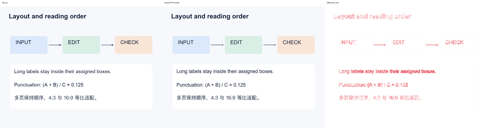

# super_img2ppt

把已有图片、扫描 PDF、图片版 PPT 重建为可编辑的 **PPTX、SVG 和场景 JSON**。
重点解决字体替换、文字挤压、换行漂移、图层遮挡，以及“预览正常、打开 PPT 变样”的问题。

这是一个 **Agent Skill + 本地 Python 运行时**。Agent 负责看图、纠正 OCR 和理解结构；
程序负责实际字体测量、布局检查、原生对象导出和真实 PPTX 渲染验收。
`prepare` 只产生待重建场景，复杂图片仍需要 Agent 理解，不能把它当成无人参与的万能转换器。



左侧是项目自制输入样例，中间是实际 PPTX 经 LibreOffice 渲染的结果，右侧是差异图。
图示不代表所有真实图片的效果；基线和抗锯齿仍有差异。[查看验收记录](docs/verification.md)。
可直接下载仓库中的 [可编辑样例](examples/editable_demo.pptx)，对照
[原图](examples/source_02.png) 和 [重建场景](examples/flow_reconstruction.json)。

**v0.3.0 新测 CLIP、Swin、密集热力图和 DDPM 表格/曲线四种真实图。**
增加原生凸多边形、线性渐变，修复文字与下标的碰撞误报，全套 **65 项测试通过**。
CLIP 的四个编码器成为原生梯形，热力图色条不再由数百条小矩形拼接，实际渲染的黑缝消失。
可编辑文件、原图对照和剩余差异见 [四种新案例报告](docs/diverse_cases.md)。
累计测试 13 张真实图片；此前的 [ICLR 论文图](docs/conference_cases.md) 和
[六个通用案例](docs/real_cases.md) 保留独立记录，旧密集表格仍有一处字体/网格冲突。

## 有哪些实际改进

| 问题 | 本版处理 |
| --- | --- |
| 用字符数估计字号，宽字挤出去 | 读取实际字体文件、字形覆盖和字重，测量文字宽度与行高 |
| 中文字体与预览字体不一致 | 显式写入各文字脚本的字体，使用字体自带的本地化族名，检查 PDF 实际字体 |
| 标题各自缩小，字号失去层级 | 默认固定字号；显式允许时有下限，同组文字统一缩放 |
| 文本框默认边距和自动换行漂移 | 显式边距、行距和测量后的换行；禁用 Office 自动适配 |
| 字体正确，混排间距仍然变宽 | 比较实际字形墨迹宽度，标记异常；按语义短语拆框保留可编辑性 |
| 模板自带阴影和样式污染 | 清除形状的效果继承和主题效果引用 |
| 形状、正文相互遮挡 | 检查边界、容器、z-order 和实际文字范围；区分留白相交与文字重叠 |
| 菱形/密集表格中空白边距误报 | 以可见墨迹判断，斜边和字形角落使用有限大小的字形遮罩；保留真实笔画碰撞 |
| 旋转标签只能变成图片 | 支持 90° 倍数旋转的原生文字，检查旋转后的字形位置与实际 PDF |
| 箭头头部与原图差得很远 | 可指定头部长宽，生成可编辑 freeform，头部也参与碰撞检查 |
| 虚线拆成数百个小对象 | 线条和形状描边支持按源像素指定实线/间隙长度 |
| 透明张量图片角落挡住文字的误报 | 按实际 alpha 和图片缩放方式检查；不透明交叠仍阻断 |
| 主字符与下标的字框相交被误报 | 比较两边的实际字形遮罩，真正重叠的文字仍阻断 |
| 梯形编码器只能用图片填充 | 原生凸多边形同时保留顶点、填充、轮廓与斜边碰撞检查 |
| 数百条色带在实际 PPTX 中出现黑缝 | 使用原生线性渐变，支持水平/垂直方向及 2–16 个色标 |
| 字体检测挂起，失败没有报告 | 记录具体字体工具路径及超时/非零退出；check/build 都生成失败诊断 |
| 原图文字与新增文字重影 | 禁止把整张源图当成重建背景，阻止烘焙文字与可编辑文字叠加 |
| 程序说成功，但文件有问题 | 复查 PPTX 原生对象，再渲染真实文件，检查文字、字形范围和字体 |

参考了 [ningzimu/image-to-editable-ppt-skill](https://github.com/ningzimu/image-to-editable-ppt-skill)
的工作流并独立实现，未直接复制其运行时代码。来源、固定提交和差异见
[UPSTREAM.md](skills/super-img2ppt/UPSTREAM.md)。

## 开始使用

Python 3.11+。开发环境使用 `uv`，真实渲染需要 LibreOffice 的 `soffice`。
中文需要本机安装可用的中文字体；`fonts.json` 会列出实际选择和替代情况。

```bash
uv sync --frozen
uv run super-img2ppt doctor
uv run super-img2ppt build examples/flow_reconstruction.json --out output/demo
```

作为 skill，安装或将 `skills/super-img2ppt` 目录接入你的 Agent 的技能目录，然后调用：

```text
$super-img2ppt 把这张图片重建为可编辑 PPTX 和 SVG，保留排版，检查字体和重叠。
```

独立安装包包含自己的运行时，不依赖本仓库的其他目录。安装和调用说明在
[SKILL.md](skills/super-img2ppt/SKILL.md)。仓库名使用 `super_img2ppt`；skill ID 和命令名使用 `super-img2ppt`。
运行 `uv run python scripts/build_package.py` 可生成 `dist/super-img2ppt.skill` 和 SHA256 校验文件。

## 转换过程

```bash
# 1. 归一化输入并生成 OCR 提示；目录必须是新目录
uv run super-img2ppt prepare page1.png page2.png --out output/job

# 2. Agent 看原图和 OCR 提示，补全 output/job/scene.json 的文字、形状和资产
#    scene.json 的空场景不能通过验收

# 3. 测量并检查场景
uv run super-img2ppt check output/job/scene.json --out output/job/check_01

# 4. 导出、实际渲染并复查
uv run super-img2ppt build output/job/scene.json --out output/job/build_01
```

支持多张图片、多页 PDF、图片版 PPTX 混合输入，保持提供顺序和 PPTX 原备注。
多种宽高比会等比适配到以第一页确定的幻灯片尺寸，不拉伸。
macOS 默认尝试本地 Vision OCR；其他系统尝试本地 Tesseract。没有识别器时仍可看图重建。
Tesseract 的中文需要本地语言包，可使用 `--ocr tesseract --languages eng+chi_sim`。

运行时不上传图片、不读取 OAuth/API 凭据、不自动安装依赖。离线转换前需先准备依赖和字体。
复杂图片资产可使用已有的本地裁剪或另行授权的图像编辑流程处理。

## 交付文件

| 文件 | 用途 |
| --- | --- |
| `editable.pptx` | 原生文字、形状、线条与独立图片 |
| `svg/*.svg` | 可编辑的文字/矢量对象，图片以内嵌资产保留 |
| `scene.resolved.json` + `assets/` | 包含已选择字体和换行的可重建源文件 |
| `fonts.json` | 实际字体、文件哈希、替代情况和嵌入标志 |
| `render/` | 实际 PPTX 转出的 PDF、PNG 及源图对比 |
| `validation.json` | 结构、字体、溢出、遮挡和渲染检查结果 |

`fail` 表示存在阻断问题，命令退出码为 2；`review` 表示仍有替代字体、间距漂移、低置信度等项目待复核；
`pass` 表示自动检查通过，仍需视觉比较；`--no-render` 只生成标记为 `unverified` 的草稿。
程序不会凭差异像素计算一个“还原度百分比”。

## 当前边界

- 图片无法唯一确定原字体；字体不嵌入文件，另一台电脑需要安装清单中的字体。
- 照片、复杂插画保留为独立图片，其内部内容不自动变成可编辑对象。
- 表格/图表可重建为形状和文字，尚不生成 Excel 数据驱动的原生图表；连线移动后不会自动重连。
- 支持 90° 倍数的旋转文字、凸多边形和水平/垂直线性渐变；任意角度文字、竖排、
  自由曲线、凹多边形、径向渐变和复杂数学排版仍有限制。
  未指定尺寸的标准 Office 箭头头部仍可能与原图不同。
- 自动验收以 LibreOffice/PDFium 为依据；原生 PowerPoint、WPS 兼容性需单独核验。
- 已覆盖 13 张真实图片，仍缺用户自己的失败样本；密集表格保留了一例未通过。
  热力图斜排标签仍为图片，DDPM 数学字宽仍有差异，Swin 的相邻帽号需要原生线条绕开 PDF 归属误报。

## 开发与验证

```bash
uv run ruff check .
uv run ruff format --check .
uv run pytest -q
uv run python scripts/verify_skill.py
uv run python scripts/build_package.py
```

见 [架构决策](docs/architecture.md)、[场景协议](skills/super-img2ppt/references/scene.md)
和 [验证记录](docs/verification.md)。核心依赖以 `uv.lock` 锁定，独立 skill 另附带哈希的
`requirements.lock`。原有样例图片由本仓库脚本绘制；新增公开真实案例的来源及单独许可证见
[通用案例 NOTICE](examples/real_cases/NOTICE.md)、[ICLR 案例 NOTICE](examples/conference_cases/NOTICE.md)
及 [新增案例 NOTICE](examples/diverse_cases/NOTICE.md)，不包含外部私有素材。
`examples/reconstruction.json` 另覆盖两页不同宽高比；`flow_before_spacing_fix.json` 保留混排间距
问题的复现输入。后者在本次验证环境中会返回 `review`，用来证明诊断能识别旧问题。

项目代码采用 MIT License；第三方案例按各自声明的许可证使用。
