<div align="center">

# super_img2ppt

### 图片里的文字、公式与曲线，都能继续编辑。

**Image → Editable PPTX · SVG · Scene JSON**

[](https://github.com/asimfish/super_img2ppt/actions/workflows/verify.yml)


[](LICENSE)

[**查看效果**](#精选效果) · [**下载编辑案例**](examples/editing/editing_examples.zip) · [**开始使用**](#开始使用) · [完整画廊](#真实复杂图效果)

</div>

把论文架构图、流程图、训练曲线和图片版幻灯片，重建为可编辑对象。Agent 看图理解结构，本地运行时测量字体、检查重叠、导出文件，再用**实际 PPTX 渲染**复核。

| 完整论文图 | 分组编辑案例 | 导出格式 |
| :---: | :---: | :---: |
| **17 例** · 具身 / 世界模型 / 通用架构 | **3 份** · 模块、公式、曲线成组编辑 | **PPTX · SVG · JSON** |

> **v0.3.7 · 为后续编辑而组织对象**
>
> 完整标签放在一个文本框；模块、公式和每条曲线可整体移动，进入组合后仍能修改子对象。[查看真实移动与改字测试 →](docs/atomic_editing.md)

## 精选效果

**左：论文原图　｜　右：实际 PPTX 经 LibreOffice 渲染。** 点击图片可查看原尺寸；完整面板均保留。照片等局部图片与字体近似在每例报告中说明。

### GR00T N1 · 整体移动模块，单独修改公式

[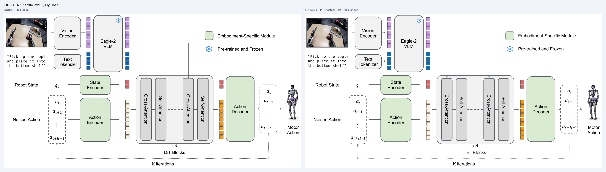](docs/previews/gallery/gr00t_n1.png)

**159 个原生对象 · 34 个语义组 · 2 张局部图片。** 双系统架构、动作公式与反馈回路完整保留；八处多行标签合并为单文本框，合并前后实际画面一致。Tokenizer 字宽与部分数学字形仍有差异。

[**下载分组 PPTX**](examples/gallery/gr00t_n1/editable.pptx) · [SVG](examples/gallery/gr00t_n1/svg/page_001.svg) · [分组清单](examples/gallery/gr00t_n1/editability.json) · [实测报告](examples/gallery/gr00t_n1/REPORT.md) · [论文 / 归属](examples/gallery/gr00t_n1/ATTRIBUTION.md)

### Cosmos 3 · 密集架构与斜排公式

[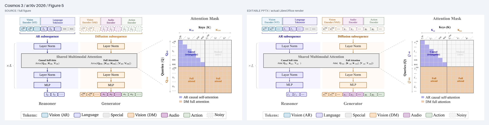](docs/previews/gallery/cosmos3.png)

**414 个原生对象 · 81 个含嵌套的组 · 1 张无文字括号图片。** 完整双塔、144 格注意力矩阵与公式可编辑；分组版外观与原发布文件一致。斜排公式仍保留字形与字距的人工复核提示。

[**下载分组 PPTX**](examples/editing/cosmos3/editable.pptx) · [SVG](examples/editing/cosmos3/svg/page_001.svg) · [斜排公式细节](docs/previews/gallery/cosmos3_detail.png) · [编辑报告](examples/editing/cosmos3/REPORT.md) · [论文 / 归属](examples/editing/cosmos3/ATTRIBUTION.md)

### RoboDream · 多视角世界模型与原生曲线

[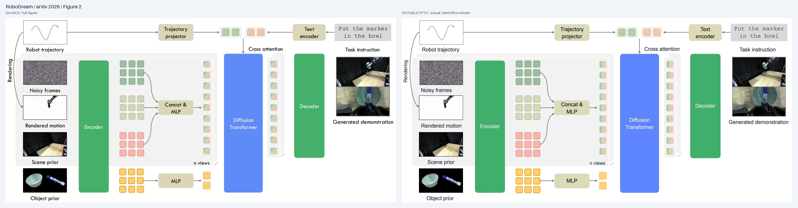](docs/previews/gallery/robodream.png)

**227 个原生对象 · 27 个语义组 · 5 张局部图片。** 四路视觉输入、多视角 token、DiT 与生成结果完整保留；18 个标签均为完整文本框，每条曲线单独成组。字体、圆角与渐变方向仍有近似。

[**下载分组 PPTX**](examples/gallery/robodream/editable.pptx) · [SVG](examples/gallery/robodream/svg/page_001.svg) · [曲线细节](docs/previews/gallery/robodream_detail.png) · [实测报告](examples/gallery/robodream/REPORT.md) · [论文 / 归属](examples/gallery/robodream/ATTRIBUTION.md)

## 下载与使用

| 想先做什么 | 文件与说明 |
| --- | --- |
| **体验整体移动、组内改字** | [三份分组编辑包 · 约 3.6 MB](examples/editing/editing_examples.zip) · [编辑说明](docs/atomic_editing.md) · [SHA256](examples/editing/SHA256SUMS) |
| **浏览全部复杂论文图** | [十七例完整包 · 约 24.4 MB](examples/gallery/paper_gallery.zip) · [文件索引](examples/gallery/index.json) · [SHA256](examples/gallery/SHA256SUMS) |
| **转换自己的图片** | [安装与调用 Skill](skills/super-img2ppt/SKILL.md) · [本地入门样例](examples/editable_demo.pptx) |

文件包包含 PPTX、SVG、原图、实际渲染、可复建场景与各例报告。三份分组版为 GR00T N1、RoboDream、Cosmos 3；历史案例保留各自版本的编辑结构。

## 开始使用

Python 3.11+，本地 LibreOffice，所需字体。开发环境使用 `uv`：

```bash
uv sync --frozen
uv run super-img2ppt doctor
uv run super-img2ppt build examples/flow_reconstruction.json --out output/demo
```

把 `skills/super-img2ppt` 接入 Agent 的技能目录，然后直接说：

```text
$super-img2ppt 把这张图片重建为可编辑 PPTX 和 SVG，保留布局，检查字体、曲线和重叠。
```

[自制入门样例 PPTX](examples/editable_demo.pptx) · [安装与调用说明](skills/super-img2ppt/SKILL.md)

仓库名是 `super_img2ppt`，skill ID 和命令名是 `super-img2ppt`。独立 skill 包包含运行时；
`uv run python scripts/build_package.py` 生成 `dist/super-img2ppt.skill` 与校验文件。


## 真实复杂图效果

按方向展开查看完整原图对照、PPTX / SVG 下载与逐例限制。**自动检查通过不等于字体或整图完全一致**；原生对象数量也不代表保真率。

### 便于后续编辑的新案例

<details>
<summary><strong>分组编辑 · GR00T N1 / RoboDream</strong> · 展开完整对照</summary>

#### GR00T N1 · 双系统架构、动作公式与嵌套模块

[](docs/previews/gallery/gr00t_n1.png)

**159 个原生对象，2 张局部图片；34 个含嵌套的语义组，41 个顶层选择单元。** 完整保留 VLM、状态/动作编码器、DiT 注意力子层、动作序列和反馈回路。八处多行模块名/指令合成单个文本框，减少 9 个文本对象，实际渲染与合并前完全一致；公式变量与脚标、token 条带和雪花图标分别组合。照片和机器人插画保留为图片。

已实际验证整组移动 State Encoder 和将完整标签改为 Joint Encoder，邻居不变。保留一项 tokenizer 字宽复核提示；长下标字形、圆角和细线仍有近似。

[分组 PPTX](examples/gallery/gr00t_n1/editable.pptx) · [SVG](examples/gallery/gr00t_n1/svg/page_001.svg) · [编辑分组清单](examples/gallery/gr00t_n1/editability.json) · [细节](docs/previews/gallery/gr00t_n1_detail.png) · [完整报告](examples/gallery/gr00t_n1/REPORT.md)

<sub>NVIDIA / Bjorck et al., “GR00T N1: An Open Foundation Model for Generalist Humanoid Robots”, Figure 3，[arXiv 2503.14734v2](https://arxiv.org/abs/2503.14734v2)，2025-03-27。[CC BY 4.0 / 归属](examples/gallery/gr00t_n1/ATTRIBUTION.md)。</sub>

#### RoboDream · 多视角世界模型与可整体编辑的曲线

[](docs/previews/gallery/robodream.png)

**227 个原生对象，5 张局部图片；27 个语义组，48 个顶层选择单元。** 完整四路视觉输入、轨迹/文本条件、多视角 token、DiT 与生成结果均保留。18 个可读标签保持完整文本框，每条曲线的原生线段和箭头组成独立组，模块与 tensor 网格也可整体选中。

已实际验证曲线组移动 12 px 和单独修改 Encoder，编辑区域外像素不变。自动检查通过；Arial 字形、圆角和渐变方向仍与源图有差异。完整图复核修正了一处局部追踪漏掉的可见曲线端部。

[分组 PPTX](examples/gallery/robodream/editable.pptx) · [SVG](examples/gallery/robodream/svg/page_001.svg) · [编辑分组清单](examples/gallery/robodream/editability.json) · [曲线细节](docs/previews/gallery/robodream_detail.png) · [完整报告](examples/gallery/robodream/REPORT.md)

<sub>Ye et al., “RoboDream: Compositional World Models for Scalable Robot Data Synthesis”, Figure 2，[arXiv 2606.02577v1](https://arxiv.org/abs/2606.02577v1)，2026-06-01。[CC BY 4.0 / 归属](examples/gallery/robodream/ATTRIBUTION.md)。</sub>

**Cosmos 3 编辑版**另外保留全部 415 个子对象，组织为 81 个嵌套组、37 个顶层选择单元。分组前后画面逐像素一致；整体移动模块/公式和修改组内文字也已验证。箭头不会自动重连。

[Cosmos 3 分组 PPTX](examples/editing/cosmos3/editable.pptx) · [三份分组编辑案例完整包](examples/editing/editing_examples.zip) · [实际编辑操作与限制](docs/atomic_editing.md) · [全部十七例文件包](examples/gallery/paper_gallery.zip)

</details>

### 2026 具身与世界模型

<details>
<summary><strong>世界模型 · DreamZero / Cosmos Policy / Cosmos 3</strong> · 展开完整对照</summary>

#### DreamZero · 世界动作模型的训练与推理

[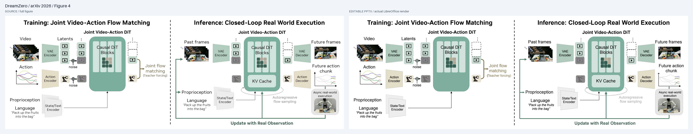](docs/previews/gallery/dreamzero.png)

**129 个原生对象，15 处局部图片。** 完整保留视频/动作输入、VAE、因果 DiT、KV Cache、动作执行和自回归反馈回路。文字、主要模块和直线可编辑；视频、噪声、机器人、动作示意及两条复杂弯曲连接保留为图片。原始构建保留字体替代 `review`；提示语字重、反馈标签字宽仍与源图不同。

[下载 PPTX](examples/gallery/dreamzero/editable.pptx) · [SVG](examples/gallery/dreamzero/svg/page_001.svg) · [细节](docs/previews/gallery/dreamzero_detail.png) · [原图与报告](examples/gallery/dreamzero)

<sub>“World Action Models are Zero-shot Policies”, Figure 4，arXiv 2602.15922v1，2026-02-17。[论文与作者](https://arxiv.org/abs/2602.15922v1) · [官方项目](https://dreamzero0.github.io/) · [CC BY 4.0 / 归属](examples/gallery/dreamzero/ATTRIBUTION.md)。</sub>

#### Cosmos Policy · 条件序列、潜变量注入与预测目标

[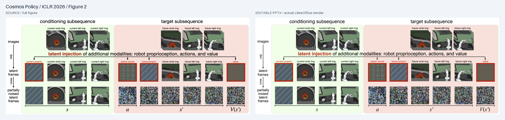](docs/previews/gallery/cosmos_policy.png)

**56 个原生对象，26 处相机、视频或潜变量图片。** 保留完整三行序列、条件/目标分区、状态与动作注入、未来状态与价值括号，文字与 `V(s′)` 可编辑。自动检查通过；小字字形仍有差异。独立局部诊断中，`V(s′)` 外缘差在 1 px 内，墨迹 IoU 仍只有 0.228，说明仅看外框不足以验收公式。此图不包含规划搜索算法。

[下载 PPTX](examples/gallery/cosmos_policy/editable.pptx) · [SVG](examples/gallery/cosmos_policy/svg/page_001.svg) · [细节](docs/previews/gallery/cosmos_policy_detail.png) · [原图与报告](examples/gallery/cosmos_policy)

<sub>Kim et al., “Cosmos Policy: Fine-Tuning Video Models for Visuomotor Control and Planning”, Figure 2，arXiv 2601.16163v1，2026-01-22；[ICLR 2026](https://proceedings.iclr.cc/paper_files/paper/2026/hash/748becc400a57c0e31cfe6a2e7951467-Abstract-Conference.html)。[固定论文版本](https://arxiv.org/abs/2601.16163v1) · [CC BY 4.0 / 归属](examples/gallery/cosmos_policy/ATTRIBUTION.md)。</sub>

#### Cosmos 3 · 双塔世界模型与完整注意力矩阵

[](docs/previews/gallery/cosmos3.png)

**414 个原生对象，仅 1 处无文字曲线括号图片。** 完整保留两座 MoT 塔、五个编码器、共享注意力公式、144 格矩阵及图例。实测后删除整条斜排文字截图，新增 **32 个原生旋转文字部件**；上下标围绕共同锚点旋转。实际渲染无阻断错误，斜排字形边界仍明确要求人工复核，字体与字距未完全匹配源图。

[下载 PPTX](examples/gallery/cosmos3/editable.pptx) · [SVG](examples/gallery/cosmos3/svg/page_001.svg) · [斜排公式细节](docs/previews/gallery/cosmos3_detail.png) · [原图与报告](examples/gallery/cosmos3) · [改动前后证据](docs/evidence/world_models/cosmos3/before_after_scenediff.json)

<sub>NVIDIA et al., “Cosmos 3: Omnimodal World Models for Physical AI”, Figure 5，arXiv 2606.02800v4，2026-06-23（PDF 封面印 06-24）。[论文与作者](https://arxiv.org/abs/2606.02800v4) · [官方项目](https://research.nvidia.com/labs/cosmos-lab/cosmos3/) · [CC BY 4.0 / 归属](examples/gallery/cosmos3/ATTRIBUTION.md)。</sub>

[本轮实测、改进与限制](docs/world_models.md) · [下载十七例完整文件包](examples/gallery/paper_gallery.zip) · [SHA256](examples/gallery/SHA256SUMS)

</details>

### 具身智能与机器人

<details>
<summary><strong>具身机器人 · OpenVLA / ECoT / DexVLA / RT-2 / 3D Diffuser Actor / ViNT</strong> · 展开完整对照</summary>

#### OpenVLA · 双视觉编码器与动作解码

[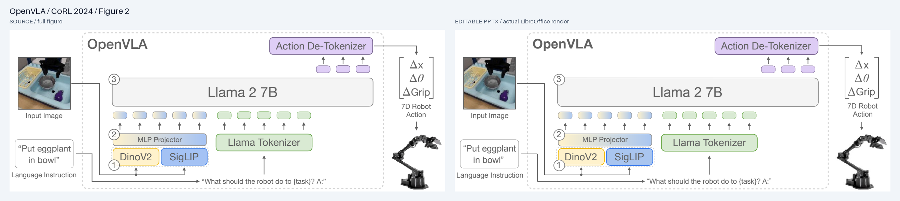](docs/previews/gallery/openvla.png)

**81 个原生对象，2 处照片资产，占图面约 8.24%。** DinoV2 / SigLIP、MLP Projector、Llama 2、语言 tokenizer 和动作反标记化完整保留；动作向量的 Δ、斜体 θ、方括号与文字可编辑。自动检查通过，De-Tokenizer 等标签的字形与源图仍有差异。

[下载 PPTX](examples/gallery/openvla/editable.pptx) · [SVG](examples/gallery/openvla/svg/page_001.svg) · [动作公式细节](docs/previews/gallery/openvla_detail.png) · [原图](examples/gallery/openvla/source.png) · [场景与报告](examples/gallery/openvla)

<sub>Kim et al., “OpenVLA: An Open-Source Vision-Language-Action Model”, CoRL 2024, Figure 2；PMLR 2025。[论文与作者](https://proceedings.mlr.press/v270/kim25c.html) · [CC BY 4.0 / 归属](examples/gallery/openvla/ATTRIBUTION.md)。</sub>

#### ECoT · 五步具身推理数据生成流程

[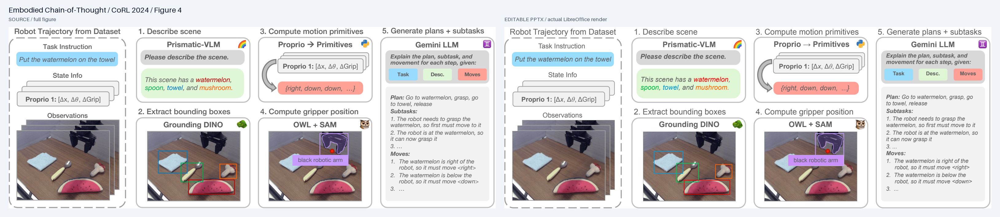](docs/previews/gallery/ecot.png)

**66 个原生对象，11 处图片实例。** 完整保留数据集列与场景描述、检测框、动作原语、抓手定位、计划生成五个模块。长段推理文字、彩色目标词、四个检测框和两处动作向量均可编辑；照片、五个小图标及一个弯箭头保留为栅格。自动检查通过，小字、圆角与部分图标边缘仍有近似。

[下载 PPTX](examples/gallery/ecot/editable.pptx) · [SVG](examples/gallery/ecot/svg/page_001.svg) · [动作原语细节](docs/previews/gallery/ecot_detail.png) · [原图](examples/gallery/ecot/source.png) · [场景与报告](examples/gallery/ecot)

<sub>Zawalski et al., “Robotic Control via Embodied Chain-of-Thought Reasoning”, CoRL 2024, Figure 4；PMLR 2025。[论文与作者](https://proceedings.mlr.press/v270/zawalski25a.html) · [CC BY 4.0 / 归属](examples/gallery/ecot/ATTRIBUTION.md)。</sub>

#### DexVLA · 两阶段训练与多动作头扩散专家

[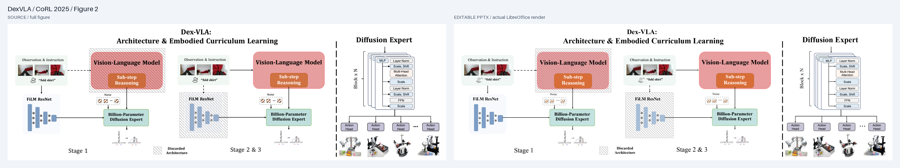](docs/previews/gallery/dexvla.png)

**302 个原生对象，10 处照片/机器人插画资产，占图面约 6.39%。** 完整保留两阶段架构、FiLM 特征、斜线纹理、扩散专家堆叠模块、多动作头及不同机器人。文字、噪声符号、纹理和跨模块箭头可编辑。自动检查通过；八处开发诊断文字框边缘差不超过 1 px，不能据此称字形或整图完全一致。斜线遮挡与小图标轮廓仍有差异。

[下载 PPTX](examples/gallery/dexvla/editable.pptx) · [SVG](examples/gallery/dexvla/svg/page_001.svg) · [扩散专家细节](docs/previews/gallery/dexvla_detail.png) · [原图](examples/gallery/dexvla/source.png) · [场景与报告](examples/gallery/dexvla)

<sub>Wen et al., “DexVLA: Vision-Language Model with Plug-In Diffusion Expert for General Robot Control”, CoRL 2025, Figure 2。[论文与作者](https://proceedings.mlr.press/v305/wen25b.html) · [CC BY 4.0 / 归属](examples/gallery/dexvla/ATTRIBUTION.md)。</sub>

[新增三例与公式实测](docs/formula_gallery.md) · [下载十七例完整文件包](examples/gallery/paper_gallery.zip) · [SHA256](examples/gallery/SHA256SUMS)

#### RT-2 · 视觉—语言—动作模型

[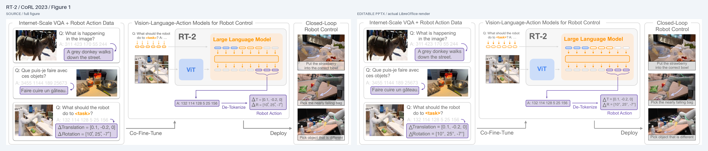](docs/previews/gallery/rt2.png)

**134 个原生对象，7 处照片资产，约占源图面积 19.05%。** 完整保留互联网 VQA 与机器人训练样例、ViT / 大语言模型、动作 token、反标记化和闭环控制三栏。法文、动作数值和照片下方说明均为可编辑文字；照片内浅紫色运动箭头随照片保留。

[下载 PPTX](examples/gallery/rt2/editable.pptx) · [SVG](examples/gallery/rt2/svg/page_001.svg) · [动作解码细节](docs/previews/gallery/rt2_detail.png) · [原图](examples/gallery/rt2/source.png) · [实际渲染](examples/gallery/rt2/actual.png) · [场景与报告](examples/gallery/rt2)

结构及文字阻断检查通过，字宽漂移保留 `review`。Δ 符号大小和动作行距已定点修正；照片说明底板用纯灰色近似半透明效果，细字、阴影和括号曲率仍不同。

<sub>改编自 Zitkovich et al., “RT-2: Vision-Language-Action Models Transfer Web Knowledge to Robotic Control”, CoRL 2023, Figure 1。[论文与作者](https://proceedings.mlr.press/v229/zitkovich23a.html) · [CC BY 4.0 / 归属](examples/gallery/rt2/ATTRIBUTION.md)。</sub>

#### 3D Diffuser Actor · 点云、动作去噪与真实机器人任务

[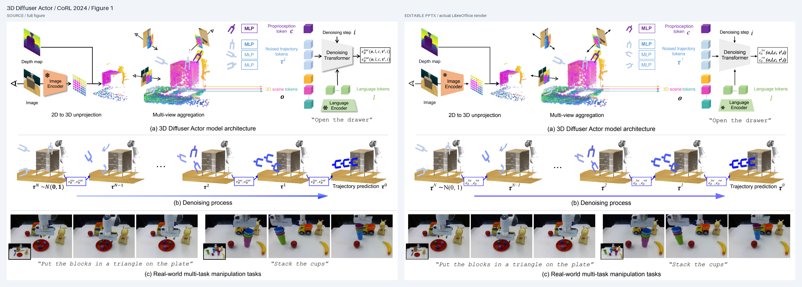](docs/previews/gallery/diffuser_actor.png)

**302 个原生对象，19 处照片/点云资产，矩形并集约占源图面积 35.31%。** 完整保留 **模型架构、去噪过程、真实多任务操作** 三大面板，包括多视角聚合、三维 scene token、语言编码器、去噪 Transformer、公式以及机器人任务描述。点云内部不可分离的抓手轨迹、部分相机射线和彩色箭尾随图片保留。

[下载 PPTX](examples/gallery/diffuser_actor/editable.pptx) · [SVG](examples/gallery/diffuser_actor/svg/page_001.svg) · [公式与模块细节](docs/previews/gallery/diffuser_actor_detail.png) · [原图](examples/gallery/diffuser_actor/source.png) · [实际渲染](examples/gallery/diffuser_actor/actual.png) · [场景与报告](examples/gallery/diffuser_actor)

本次公式修订后，结构、原生对象与实际文字检查均为 `pass`。修复变量/标点样式、真正的上下标及三处重复去噪公式；初始化保留数学关系符 `∼`，显式使用独立字体。数字、希腊字形、阴影和渐变仍有差异。[公式前后对照](docs/previews/gallery/formula_typography.png) · [修订证据](docs/formula_gallery.md)。

<sub>改编自 Ke, Gkanatsios & Fragkiadaki, “3D Diffuser Actor: Policy Diffusion with 3D Scene Representations”, CoRL 2024, Figure 1；PMLR 论文集于 2025 年出版。[论文与作者](https://proceedings.mlr.press/v270/ke25a.html) · [CC BY 4.0 / 归属](examples/gallery/diffuser_actor/ATTRIBUTION.md)。</sub>

#### ViNT · 视觉导航 Transformer

[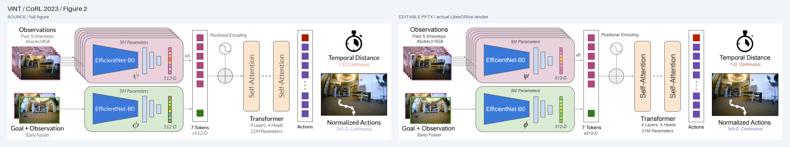](docs/previews/gallery/vint.png)

**115 个原生对象，3 处照片资产，约占源图面积 13.40%。** 完整保留观察堆叠、双 EfficientNet-B0 编码器、token、位置编码、自注意力模块、时间距离和动作输出。照片堆叠、边框和输出照片内的白色路径随图片保留；两处竖排 Self-Attention、希腊符号、维度和输出说明可编辑。

[下载 PPTX](examples/gallery/vint/editable.pptx) · [SVG](examples/gallery/vint/svg/page_001.svg) · [注意力模块细节](docs/previews/gallery/vint_detail.png) · [原图](examples/gallery/vint/source.png) · [实际渲染](examples/gallery/vint/actual.png) · [场景与报告](examples/gallery/vint)

阻断检查通过，7 Tokens 字宽漂移保留 `review`。斜体、希腊符号和竖排文字经过实际渲染复核与位置修正；部分字重、字宽以及秒表图标轮廓仍有近似。

<sub>改编自 Shah et al., “ViNT: A Foundation Model for Visual Navigation”, CoRL 2023, Figure 2。[论文与作者](https://proceedings.mlr.press/v229/shah23a.html) · [CC BY 4.0 / 归属](examples/gallery/vint/ATTRIBUTION.md)。</sub>

[具身案例测试与复建记录](docs/embodied_figures.md) · [下载十七例完整文件包](examples/gallery/paper_gallery.zip) · [SHA256](examples/gallery/SHA256SUMS)

</details>

### 通用架构与训练曲线

<details>
<summary><strong>通用架构与曲线 · Griffin / BLIP-2 / Hyena / GaLore / Vision Mamba / Mamba-2</strong> · 展开完整对照</summary>

#### Griffin · 数据库表格到图模型

[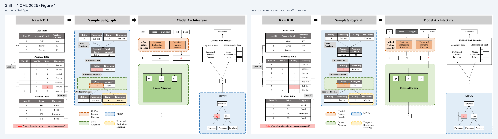](docs/previews/gallery/griffin.png)

**338 个原生对象，零可见栅格图片。** 三张原始表、采样子图、编码器、交叉注意力、MPNN 和任务解码器完整保留；表格数据、标题、节点与连线均可编辑。

[下载 PPTX](examples/gallery/griffin/editable.pptx) · [SVG](examples/gallery/griffin/svg/page_001.svg) · [表格细节放大](docs/previews/gallery/griffin_detail.png) · [原图](examples/gallery/griffin/source.png) · [场景与资产](examples/gallery/griffin) · [测试报告](docs/evidence/gallery_extension/griffin/REPORT.md)

修复 PDFium 行末连字符误报后，交付文件自动检查通过；严格区域对比 5/12 达标，保留区域 0/4。表格文字、解码器小字和细连线仍有差异，完整编辑性不等于像素保真。

<sub>改编自 Wang et al., “Griffin: Towards a Graph-Centric Relational Database Foundation Model”, ICML 2025, Figure 1。[论文与作者](https://proceedings.mlr.press/v267/wang25da.html) · [CC BY 4.0 / 来源](examples/gallery/griffin/provenance.json)。</sub>

#### BLIP-2 · Q-Former 与三种注意力掩码

[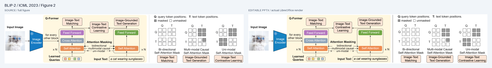](docs/previews/gallery/blip2.png)

**137 个原生对象，2 处局部图片。** 完整保留 Q-Former、图文训练目标、三种注意力矩阵及每个灰/白单元格；猫照片和雪花图标保留为图片，占源图面积约 3.38%。

[下载 PPTX](examples/gallery/blip2/editable.pptx) · [SVG](examples/gallery/blip2/svg/page_001.svg) · [模块细节放大](docs/previews/gallery/blip2_detail.png) · [原图](examples/gallery/blip2/source.png) · [场景与资产](examples/gallery/blip2) · [测试报告](docs/evidence/gallery_extension/blip2/REPORT.md)

阻断检查通过，文字宽度漂移保留 `review`。开发区域 3/8 达标；保留区域 3 项有效失败，另 1 项使用黑色掩码检查白字，测量定义无效，单独标记。标签字宽与细线仍未全部对齐。

<sub>改编自 Li et al., “BLIP-2: Bootstrapping Language-Image Pre-training with Frozen Image Encoders and Large Language Models”, ICML 2023, Figure 2。[论文与作者](https://proceedings.mlr.press/v202/li23q.html) · [CC BY 4.0 / 来源](examples/gallery/blip2/provenance.json)。</sub>

#### Hyena Hierarchy · 算子链与隐式滤波器

[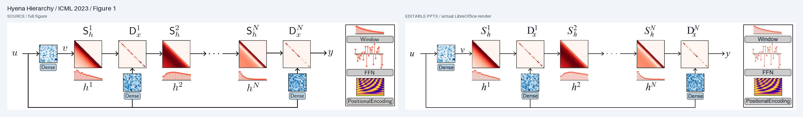](docs/previews/gallery/hyena.png)

**408 个原生对象，7 个无文字热图裁片。** 完整算子链、广播路径、上下标、离散滤波器杆状图、Window/FFN/PositionalEncoding 均保留；离散点、杆、箭头与对角矩阵单元可编辑。热图内部保留为图片，占源图面积约 10.37%。

[下载 PPTX](examples/gallery/hyena/editable.pptx) · [SVG](examples/gallery/hyena/svg/page_001.svg) · [滤波器细节放大](docs/previews/gallery/hyena_detail.png) · [原图](examples/gallery/hyena/source.png) · [场景与资产](examples/gallery/hyena) · [测试报告](docs/evidence/gallery_extension/hyena/REPORT.md)

自动检查通过；严格区域对比 2/12 达标，保留区域 0/4。数学字体与标签墨迹仍有明显差异；离散杆状图按可见像素重建，不代表恢复了论文实验数值。

<sub>改编自 Poli et al., “Hyena Hierarchy: Towards Larger Convolutional Language Models”, ICML 2023, Figure 1。[论文与作者](https://proceedings.mlr.press/v202/poli23a.html) · [CC BY 4.0 / 归属](examples/gallery/hyena/ATTRIBUTION.md)。</sub>

[本轮完整测量、失败与修复证据](docs/gallery_extension.md) · [下载当前十七例完整文件包](examples/gallery/paper_gallery.zip) · [SHA256](examples/gallery/SHA256SUMS)

#### GaLore · 四面板训练曲线

[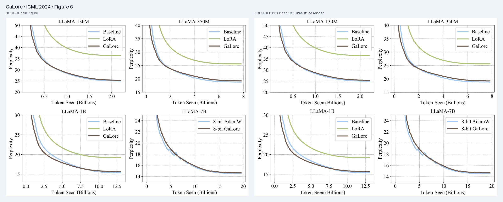](docs/previews/gallery/galore.png)

**4 个面板、11 条可见曲线，753 个原生对象。** 文字、坐标轴、图例与可辨认曲线可编辑；右下角交叉处保留一块不含文字的原图，面积占 1.81%。不推测被遮挡的实验数据。

[下载 PPTX](examples/gallery/galore/editable.pptx) · [SVG](examples/gallery/galore/svg/page_001.svg) · [原图](examples/gallery/galore/source.png) · [实际渲染](examples/gallery/galore/actual.png) · [可复建场景与资产](examples/gallery/galore) · [测试报告](docs/evidence/public_figures/galore/REPORT.md)

自动检查通过；10 个记录区域中 4 个满足各自严格边界/掩码阈值，若干图例与标签仍不达标。冻结后的独立绿色曲线诊断 IoU 为 0.949、边界误差 0 px，**仅代表该区域**。

<sub>改编自 Zhao et al., “GaLore: Memory-Efficient LLM Training by Gradient Low-Rank Projection”, ICML 2024, Figure 6。[论文与作者](https://proceedings.mlr.press/v235/zhao24s.html) · [CC BY 4.0 / 归属与修改说明](examples/gallery/galore/SOURCE_LICENSE.md)。</sub>

#### Vision Mamba · 双向编码器完整架构

[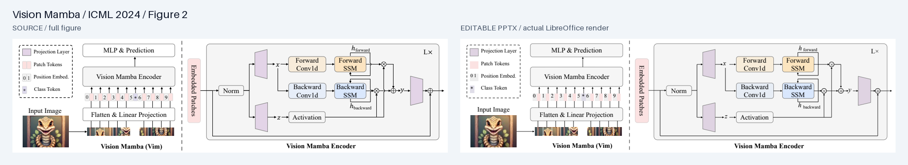](docs/previews/gallery/vision_mamba.png)

**158 个原生对象，3 处图片资产。** 包括两侧完整面板、0–9 token、双向 Conv/SSM、门控、状态回路、投影梯形和残差线；标签与连线可编辑。

[下载 PPTX](examples/gallery/vision_mamba/editable.pptx) · [SVG](examples/gallery/vision_mamba/svg/page_001.svg) · [原图](examples/gallery/vision_mamba/source.png) · [实际渲染](examples/gallery/vision_mamba/actual.png) · [场景与资产](examples/gallery/vision_mamba) · [测试报告](docs/evidence/public_figures/vision_mamba/REPORT.md)

自动检查通过；严格区域对比 5/12 达标，保留区域 0/4。小字、token 编号和部分箭头仍有差异；未在揭示保留区域结果后继续调整。

<sub>改编自 Zhu et al., “Vision Mamba: Efficient Visual Representation Learning with Bidirectional State Space Model”, ICML 2024, Figure 2。[论文与作者](https://proceedings.mlr.press/v235/zhu24f.html) · [CC BY 4.0 / 归属与修改说明](examples/gallery/vision_mamba/ATTRIBUTION.md)。</sub>

#### Mamba-2 · 矩阵分块与状态流

[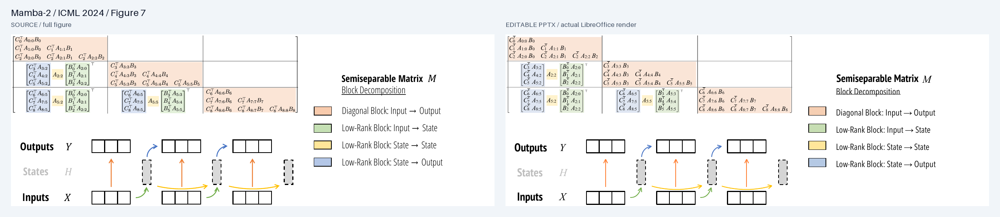](docs/previews/gallery/mamba2.png)

**475 个原生对象，零可见栅格图片。** 完整矩阵、因式分解、上下标、状态流和图例均拆为可编辑文字、形状或线条；公式转置符部分由原生短线组成。

[下载 PPTX](examples/gallery/mamba2/editable.pptx) · [SVG](examples/gallery/mamba2/svg/page_001.svg) · [原图](examples/gallery/mamba2/source.png) · [实际渲染](examples/gallery/mamba2/actual.png) · [场景与资产](examples/gallery/mamba2) · [测试报告](docs/evidence/public_figures/mamba2/REPORT.md)

结构和实际文字检查通过，原始构建保留字体替代 `review`。严格区域对比仅 2/9 达标；标题字形、公式和虚线仍不同。这是复杂可编辑重建案例，尚未达到高保真目标。

<sub>改编自 Tri Dao & Albert Gu, “Transformers are SSMs: Generalized Models and Efficient Algorithms Through Structured State Space Duality”, ICML 2024, Figure 7。[论文](https://proceedings.mlr.press/v235/dao24a.html) · [CC BY 4.0 / 来源与修改说明](examples/gallery/mamba2/provenance.json)。</sub>

[完整方法、阈值与评测限制](docs/public_figures.md) · [上一轮三例文件包](examples/gallery/complex_figures.zip) · [SHA256](examples/gallery/SHA256SUMS)

GaLore 和 Mamba-2 的部分原保留区域曾在调整期间被查看，因此不能作为盲测；Mamba-2 还记录了一处超过三次修复预算的偏差。原始记录和失败结果均保留。不同案例的掩码与区域不同，不合并成“转换准确率”。

</details>

## 把案例反馈变成系统能力

| 看图重建时遇到的问题 | 已实现的处理 | 实测与用法 |
| --- | --- | --- |
| 对象太碎，模块难以整体修改 | 原生嵌套组合；完整标签、公式与每条曲线按编辑任务组织 | [编辑实测](docs/atomic_editing.md) · [组合用法](skills/super-img2ppt/references/editing.md) |
| 上下标、字重和斜体不一致 | `compose-math` 显式测量与定位各部件；支持共同中心旋转 | [公式修订](docs/formula_gallery.md) · [斜排公式](skills/super-img2ppt/references/diagonal_text.md) |
| 曲线峰谷偏移、分段出现白缝 | `trace-curve` 按可见像素追踪；原生圆端点与端部复核 | [曲线证据](docs/public_figures.md) · [追踪用法](skills/super-img2ppt/references/curves.md) |
| 外框对齐了，字形仍不同 | `compare-roi` 同坐标比较墨迹，标记空白和截断区域 | [独立诊断](docs/world_models.md) · [局部对比用法](skills/super-img2ppt/references/regions.md) |

<details>
<summary><strong>查看公式与曲线修复前后对照</strong></summary>

### 公式排版

[](docs/previews/gallery/formula_typography.png)

从左到右为**原图、旧 PPTX、新 PPTX**，同坐标放大 4 倍。3D Diffuser Actor 的六处公式修订为 60 个原生文字部件，保留字重、斜体、上下标和直立标点；部分数字、希腊字形与关系符仍不同。[完整证据](docs/formula_gallery.md)。

### 曲线端点

[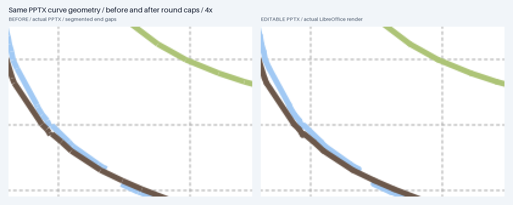](docs/previews/gallery/curve_caps.png)

两边均为**实际 PPTX**，同位置放大 4 倍；558 条线段仅增加圆端点，路径与字体保持一致。细小像素阶梯仍存在。[场景差异证据](docs/evidence/public_figures/galore/cap_scene_diff.json)。

</details>

## 工作流程

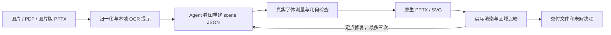

```bash
uv run super-img2ppt prepare page1.png page2.png --out output/job
# Agent 查看 source.png，纠正 OCR，补全 scene.json 的文字、形状与独立资产
uv run super-img2ppt check output/job/scene.json --out output/job/check_01
uv run super-img2ppt build output/job/scene.json --out output/job/build_01
```

`prepare` 生成待重建场景；复杂图需要 Agent 理解和复核。支持多页混合输入，保持顺序、宽高比和原备注。
运行时使用本地 OCR、字体和渲染工具，不上传图片，不读取 API 凭据，不自动安装依赖。

## 质量与边界

| 交付物 | 可以检查什么 |
| --- | --- |
| `editable.pptx`、`svg/` | 原生文字、形状、线条，以及明确保留的图片 |
| `scene.resolved.json`、`assets/` | 可修改、复建的场景与相对路径资产 |
| `editability.json` | 语义组、成员层级与未组合对象 |
| `fonts.json` | 实际字体文件、字重、替代情况与哈希 |
| `render/`、`validation.json` | 实际 PPTX 的 PDF/PNG，以及溢出、遮挡和字体检查 |

- `fail` 为阻断问题；`review` 为字体替代等待复核项；`pass` 只表示自动检查通过。源图保真另行比较。
- `--no-render` 只能生成 `unverified` 草稿，不能代替实际文件验收。
- 照片、复杂插画、无法可靠分离的交叉区域可能保留为局部图片，并明确标注。
- 字体不能从像素唯一确定，也不会嵌入文件；另一台电脑需要对应字体。复杂数学排版仍有限制。
- 曲线是原生线段；不恢复实验数值、不生成 Excel 数据图表，移动节点也不会自动重连。
- 已验证 LibreOffice 渲染；原生 PowerPoint、WPS 尚未单独验证。

<details>
<summary><strong>历史复杂案例与失败记录</strong></summary>

- [Grounding DINO、GLaMM、UniAD 完整主图](docs/main_figures.md)：严格区域分别 11/35、3/39、8/36 达标。
- [BEVFormer、InternImage、DUSt3R](docs/complex_figures.md)：密集架构与三维示例。
- [super_teaser 概念图](docs/teaser_cases.md)：明确区别于原始论文实验图。
- [CLIP、Swin 等](docs/diverse_cases.md) · [ICLR 论文图](docs/conference_cases.md) · [通用案例](docs/real_cases.md)。

保留完整面板、原始失败与区域指标，不能据此保证任意复杂图片都对齐。

</details>

## 开发与验证

```bash
uv run ruff check .
uv run ruff format --check .
uv run pytest -q
uv run python scripts/verify_skill.py
uv run python scripts/build_capability_registry.py --check
uv run python scripts/build_package.py
```

[分组编辑验证](docs/atomic_editing.md) · [世界模型实测](docs/world_models.md) · [连字符修复](docs/gallery_extension.md) · [曲线与字体改进证据](docs/public_figures.md) · [场景协议](skills/super-img2ppt/references/scene.md) · [架构](docs/architecture.md) · [历史验证](docs/verification.md)

工作流参考 [ningzimu/image-to-editable-ppt-skill](https://github.com/ningzimu/image-to-editable-ppt-skill)，运行时独立实现；[来源与差异](skills/super-img2ppt/UPSTREAM.md)。README 的实图展示、快捷入口与证据链接组织参考 [super_translate](https://github.com/asimfish/super_translate) 和 [ARIS](https://github.com/wanshuiyin/auto-claude-code-research-in-sleep)，[固定版本与参考边界](docs/evidence/public_figures/design_reference.json)。

项目代码采用 **MIT**；第三方图示按[各自来源和许可证](examples/gallery/NOTICE.md)使用，图示作者未背书本项目。
