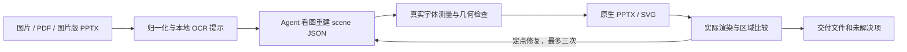

<div align="center">

# super_img2ppt

### 把图里的文字、形状和曲线，变回可以修改的对象。

**Image → Editable PPTX · SVG · Scene JSON**

[](https://github.com/asimfish/super_img2ppt/actions/workflows/verify.yml)


[](LICENSE)

[看真实效果](#真实复杂图效果) · [开始使用](#开始使用) · [曲线修复](#把案例反馈变成系统能力) · [工作流程](#工作流程) · [质量与边界](#质量与边界)

</div>

一个 **Agent Skill + 本地 Python 运行时**：Agent 看图、纠正 OCR、理解结构；运行时测量真实字体、检查重叠、导出原生对象，再渲染 **实际 PPTX** 验收。适合论文架构图、流程图、训练曲线和图片版幻灯片。

**v0.3.4：再添 BLIP-2、Hyena、Griffin 三张完整复杂图，画廊扩展到六例，并修复 PDF 行末连字符误报。**
从多模态掩码、密集数据库表格、算子链到训练曲线，均提供原图与实际 PPTX 对照。复杂文字的高保真仍未全部达标。

## 真实复杂图效果

所有对照均为 **左：论文原图；右：实际 PPTX 经 LibreOffice 渲染**。点击图片查看原尺寸。
保留完整图面板，没有只挑容易的局部。原生对象数量说明编辑边界；区域对比记录对齐和字形差异，两者分别报告。

### Griffin · 数据库表格到图模型

[](docs/previews/gallery/griffin.png)

**338 个原生对象，零可见栅格图片。** 三张原始表、采样子图、编码器、交叉注意力、MPNN 和任务解码器完整保留；表格数据、标题、节点与连线均可编辑。

[下载 PPTX](examples/gallery/griffin/editable.pptx) · [SVG](examples/gallery/griffin/svg/page_001.svg) · [表格细节放大](docs/previews/gallery/griffin_detail.png) · [原图](examples/gallery/griffin/source.png) · [场景与资产](examples/gallery/griffin) · [测试报告](docs/evidence/gallery_extension/griffin/REPORT.md)

修复 PDFium 行末连字符误报后，交付文件自动检查通过；严格区域对比 5/12 达标，保留区域 0/4。表格文字、解码器小字和细连线仍有差异，完整编辑性不等于像素保真。

<sub>改编自 Wang et al., “Griffin: Towards a Graph-Centric Relational Database Foundation Model”, ICML 2025, Figure 1。[论文与作者](https://proceedings.mlr.press/v267/wang25da.html) · [CC BY 4.0 / 来源](examples/gallery/griffin/provenance.json)。</sub>

### BLIP-2 · Q-Former 与三种注意力掩码

[](docs/previews/gallery/blip2.png)

**137 个原生对象，2 处局部图片。** 完整保留 Q-Former、图文训练目标、三种注意力矩阵及每个灰/白单元格；猫照片和雪花图标保留为图片，占源图面积约 3.38%。

[下载 PPTX](examples/gallery/blip2/editable.pptx) · [SVG](examples/gallery/blip2/svg/page_001.svg) · [模块细节放大](docs/previews/gallery/blip2_detail.png) · [原图](examples/gallery/blip2/source.png) · [场景与资产](examples/gallery/blip2) · [测试报告](docs/evidence/gallery_extension/blip2/REPORT.md)

阻断检查通过，文字宽度漂移保留 `review`。开发区域 3/8 达标；保留区域 3 项有效失败，另 1 项使用黑色掩码检查白字，测量定义无效，单独标记。标签字宽与细线仍未全部对齐。

<sub>改编自 Li et al., “BLIP-2: Bootstrapping Language-Image Pre-training with Frozen Image Encoders and Large Language Models”, ICML 2023, Figure 2。[论文与作者](https://proceedings.mlr.press/v202/li23q.html) · [CC BY 4.0 / 来源](examples/gallery/blip2/provenance.json)。</sub>

### Hyena Hierarchy · 算子链与隐式滤波器

[](docs/previews/gallery/hyena.png)

**408 个原生对象，7 个无文字热图裁片。** 完整算子链、广播路径、上下标、离散滤波器杆状图、Window/FFN/PositionalEncoding 均保留；离散点、杆、箭头与对角矩阵单元可编辑。热图内部保留为图片，占源图面积约 10.37%。

[下载 PPTX](examples/gallery/hyena/editable.pptx) · [SVG](examples/gallery/hyena/svg/page_001.svg) · [滤波器细节放大](docs/previews/gallery/hyena_detail.png) · [原图](examples/gallery/hyena/source.png) · [场景与资产](examples/gallery/hyena) · [测试报告](docs/evidence/gallery_extension/hyena/REPORT.md)

自动检查通过；严格区域对比 2/12 达标，保留区域 0/4。数学字体与标签墨迹仍有明显差异；离散杆状图按可见像素重建，不代表恢复了论文实验数值。

<sub>改编自 Poli et al., “Hyena Hierarchy: Towards Larger Convolutional Language Models”, ICML 2023, Figure 1。[论文与作者](https://proceedings.mlr.press/v202/poli23a.html) · [CC BY 4.0 / 归属](examples/gallery/hyena/ATTRIBUTION.md)。</sub>

[本轮完整测量、失败与修复证据](docs/gallery_extension.md) · [下载六例完整文件包](examples/gallery/paper_gallery.zip) · [SHA256](examples/gallery/SHA256SUMS)

### GaLore · 四面板训练曲线

[](docs/previews/gallery/galore.png)

**4 个面板、11 条可见曲线，753 个原生对象。** 文字、坐标轴、图例与可辨认曲线可编辑；右下角交叉处保留一块不含文字的原图，面积占 1.81%。不推测被遮挡的实验数据。

[下载 PPTX](examples/gallery/galore/editable.pptx) · [SVG](examples/gallery/galore/svg/page_001.svg) · [原图](examples/gallery/galore/source.png) · [实际渲染](examples/gallery/galore/actual.png) · [可复建场景与资产](examples/gallery/galore) · [测试报告](docs/evidence/public_figures/galore/REPORT.md)

自动检查通过；10 个记录区域中 4 个满足各自严格边界/掩码阈值，若干图例与标签仍不达标。冻结后的独立绿色曲线诊断 IoU 为 0.949、边界误差 0 px，**仅代表该区域**。

<sub>改编自 Zhao et al., “GaLore: Memory-Efficient LLM Training by Gradient Low-Rank Projection”, ICML 2024, Figure 6。[论文与作者](https://proceedings.mlr.press/v235/zhao24s.html) · [CC BY 4.0 / 归属与修改说明](examples/gallery/galore/SOURCE_LICENSE.md)。</sub>

### Vision Mamba · 双向编码器完整架构

[](docs/previews/gallery/vision_mamba.png)

**158 个原生对象，3 处图片资产。** 包括两侧完整面板、0–9 token、双向 Conv/SSM、门控、状态回路、投影梯形和残差线；标签与连线可编辑。

[下载 PPTX](examples/gallery/vision_mamba/editable.pptx) · [SVG](examples/gallery/vision_mamba/svg/page_001.svg) · [原图](examples/gallery/vision_mamba/source.png) · [实际渲染](examples/gallery/vision_mamba/actual.png) · [场景与资产](examples/gallery/vision_mamba) · [测试报告](docs/evidence/public_figures/vision_mamba/REPORT.md)

自动检查通过；严格区域对比 5/12 达标，保留区域 0/4。小字、token 编号和部分箭头仍有差异；未在揭示保留区域结果后继续调整。

<sub>改编自 Zhu et al., “Vision Mamba: Efficient Visual Representation Learning with Bidirectional State Space Model”, ICML 2024, Figure 2。[论文与作者](https://proceedings.mlr.press/v235/zhu24f.html) · [CC BY 4.0 / 归属与修改说明](examples/gallery/vision_mamba/ATTRIBUTION.md)。</sub>

### Mamba-2 · 矩阵分块与状态流

[](docs/previews/gallery/mamba2.png)

**475 个原生对象，零可见栅格图片。** 完整矩阵、因式分解、上下标、状态流和图例均拆为可编辑文字、形状或线条；公式转置符部分由原生短线组成。

[下载 PPTX](examples/gallery/mamba2/editable.pptx) · [SVG](examples/gallery/mamba2/svg/page_001.svg) · [原图](examples/gallery/mamba2/source.png) · [实际渲染](examples/gallery/mamba2/actual.png) · [场景与资产](examples/gallery/mamba2) · [测试报告](docs/evidence/public_figures/mamba2/REPORT.md)

结构和实际文字检查通过，原始构建保留字体替代 `review`。严格区域对比仅 2/9 达标；标题字形、公式和虚线仍不同。这是复杂可编辑重建案例，尚未达到高保真目标。

<sub>改编自 Tri Dao & Albert Gu, “Transformers are SSMs: Generalized Models and Efficient Algorithms Through Structured State Space Duality”, ICML 2024, Figure 7。[论文](https://proceedings.mlr.press/v235/dao24a.html) · [CC BY 4.0 / 来源与修改说明](examples/gallery/mamba2/provenance.json)。</sub>

[完整方法、阈值与评测限制](docs/public_figures.md) · [上一轮三例文件包](examples/gallery/complex_figures.zip) · [SHA256](examples/gallery/SHA256SUMS)

GaLore 和 Mamba-2 的部分原保留区域曾在调整期间被查看，因此不能作为盲测；Mamba-2 还记录了一处超过三次修复预算的偏差。原始记录和失败结果均保留。不同案例的掩码与区域不同，不合并成“转换准确率”。

## 把案例反馈变成系统能力

### 曲线按像素提取，实际 PPTX 消除分段白缝

[](docs/previews/gallery/curve_caps.png)

上图两边都是 **实际 PPTX**，同一位置放大 4 倍；558 条线段仅增加 `line_cap: round`，路径和字体保持一致。[修复前文件](examples/gallery/galore/before_caps.pptx) · [场景差异证据](docs/evidence/public_figures/galore/cap_scene_diff.json)。细小像素阶梯仍然存在。

| 实际遇到的问题 | 进入系统的处理 |
| --- | --- |
| 行末连字符可见，PDF 文字检查却报缺失 | 根据 PDFium 明确的连字符标记恢复诊断文本，保留原始提取值；缺字仍失败 |
| 手绘趋势或猜正弦，峰谷偏离原图 | `trace-curve` 从指定颜色和区域提取可见笔画，输出可编辑线段 |
| 同色预算虚线混入曲线 | 显式排除已确认的参考线带；不自动删除真实水平平台 |
| 陡峭线段或遮挡无法可靠追踪 | 可切换 `--axis y`；歧义分支和长缺口明确失败，记录短插值 |
| 原生分段在 Office 渲染中露出白缝 | PPTX/SVG 同时支持圆端点，端点范围参与越界与碰撞检查 |
| TTC 中斜体被误当常规字体 | 同时读取 OS/2 和 `head.macStyle` 样式标志，回归覆盖缺失标志情况 |
| 左侧斜体越界，只扩右边仍修不好 | 报告四方向越界距离和源像素值，指南说明保持字形原点的修框方法 |

```bash
uv run super-img2ppt trace-curve chart.png \
  --roi 100 80 300 160 --color '#1F77B4' \
  --stroke-width 1.5 --prefix loss_blue --out output/trace_01
```

检查 `overlay.png` 和 `trace.json` 后，将 `elements.json` 合入对应场景，再执行 `build`。
这一步只输出待复核的曲线片段，不生成数据驱动图表。[完整用法与失败边界](skills/super-img2ppt/references/curves.md)。

## 开始使用

Python 3.11+，本地 LibreOffice，所需字体。开发环境使用 `uv`：

```bash
uv sync --frozen
uv run super-img2ppt doctor
uv run super-img2ppt build examples/flow_reconstruction.json --out output/demo
```

把 `skills/super-img2ppt` 接入 Agent 的技能目录，然后直接说：

```text
$super-img2ppt 把这张图片重建为可编辑 PPTX 和 SVG，保留布局，检查字体、曲线和重叠。
```

[自制入门样例 PPTX](examples/editable_demo.pptx) · [安装与调用说明](skills/super-img2ppt/SKILL.md) · [Releases](https://github.com/asimfish/super_img2ppt/releases)

仓库名是 `super_img2ppt`，skill ID 和命令名是 `super-img2ppt`。独立 skill 包包含运行时；
`uv run python scripts/build_package.py` 生成 `dist/super-img2ppt.skill` 与校验文件。

## 工作流程



```bash
uv run super-img2ppt prepare page1.png page2.png --out output/job
# Agent 查看 source.png，纠正 OCR，补全 scene.json 的文字、形状与独立资产
uv run super-img2ppt check output/job/scene.json --out output/job/check_01
uv run super-img2ppt build output/job/scene.json --out output/job/build_01
```

`prepare` 生成待重建场景；复杂图需要 Agent 理解和复核。支持多页混合输入，保持顺序、宽高比和原备注。
运行时使用本地 OCR、字体和渲染工具，不上传图片，不读取 API 凭据，不自动安装依赖。

## 质量与边界

| 交付物 | 可以检查什么 |
| --- | --- |
| `editable.pptx`、`svg/` | 原生文字、形状、线条，以及明确保留的图片 |
| `scene.resolved.json`、`assets/` | 可修改、复建的场景与相对路径资产 |
| `fonts.json` | 实际字体文件、字重、替代情况与哈希 |
| `render/`、`validation.json` | 实际 PPTX 的 PDF/PNG，以及溢出、遮挡和字体检查 |

- `fail` 为阻断问题；`review` 为字体替代等待复核项；`pass` 只表示自动检查通过。源图保真另行比较。
- `--no-render` 只能生成 `unverified` 草稿，不能代替实际文件验收。
- 照片、复杂插画、无法可靠分离的交叉区域可能保留为局部图片，并明确标注。
- 字体不能从像素唯一确定，也不会嵌入文件；另一台电脑需要对应字体。复杂数学排版仍有限制。
- 曲线是原生线段；不恢复实验数值、不生成 Excel 数据图表，移动节点也不会自动重连。
- 已验证 LibreOffice 渲染；原生 PowerPoint、WPS 尚未单独验证。

<details>
<summary><strong>历史复杂案例与失败记录</strong></summary>

- [Grounding DINO、GLaMM、UniAD 完整主图](docs/main_figures.md)：严格区域分别 11/35、3/39、8/36 达标。
- [BEVFormer、InternImage、DUSt3R](docs/complex_figures.md)：密集架构与三维示例。
- [super_teaser 概念图](docs/teaser_cases.md)：明确区别于原始论文实验图。
- [CLIP、Swin 等](docs/diverse_cases.md) · [ICLR 论文图](docs/conference_cases.md) · [通用案例](docs/real_cases.md)。

保留完整面板、原始失败与区域指标，不能据此保证任意复杂图片都对齐。

</details>

## 开发与验证

```bash
uv run ruff check .
uv run ruff format --check .
uv run pytest -q
uv run python scripts/verify_skill.py
uv run python scripts/build_capability_registry.py --check
uv run python scripts/build_package.py
```

[新增三例与连字符修复](docs/gallery_extension.md) · [曲线与字体改进证据](docs/public_figures.md) · [场景协议](skills/super-img2ppt/references/scene.md) · [架构](docs/architecture.md) · [历史验证](docs/verification.md)

工作流参考 [ningzimu/image-to-editable-ppt-skill](https://github.com/ningzimu/image-to-editable-ppt-skill)，运行时独立实现；[来源与差异](skills/super-img2ppt/UPSTREAM.md)。README 的实图展示、快捷入口与证据链接组织参考 [super_translate](https://github.com/asimfish/super_translate) 和 [ARIS](https://github.com/wanshuiyin/auto-claude-code-research-in-sleep)，[固定版本与参考边界](docs/evidence/public_figures/design_reference.json)。

项目代码采用 **MIT**；第三方图示按[各自来源和许可证](examples/gallery/NOTICE.md)使用，图示作者未背书本项目。
