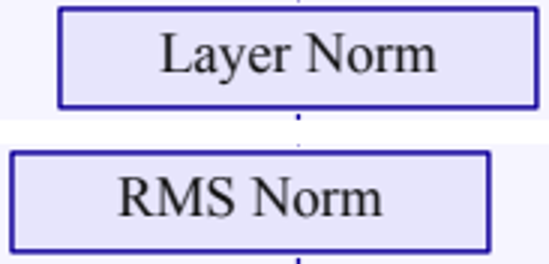

# 更多复杂图与合理编辑粒度：v0.3.7

这轮新增 GR00T N1、RoboDream 两张完整方法图，并把已发布的 Cosmos 3 另做成分组编辑版。重点是一次选择能对应一个有意义的编辑任务，同时保留内部对象的编辑能力。历史十五例原文件与预览保持冻结；新增两例使用分组导出，当前完整论文画廊共十七例。

[下载三份分组编辑案例及完整场景](../examples/editing/editing_examples.zip) · [校验和](../examples/editing/SHA256SUMS) · [十七例论文图](../examples/gallery/paper_gallery.zip)

## 新增完整图

**GR00T N1，Figure 3**：NVIDIA / Bjorck et al., *GR00T N1: An Open Foundation Model for Generalist Humanoid Robots*，[arXiv 2503.14734v2](https://arxiv.org/abs/2503.14734v2)，2025-03-27，PDF 第 4 页。完整双系统架构、状态与动作编码器、四个注意力子层、动作公式、token 条带与 K 次反馈回路都保留。

[分组 PPTX](../examples/gallery/gr00t_n1/editable.pptx) · [SVG](../examples/gallery/gr00t_n1/svg/page_001.svg) · [原子对象与分组清单](../examples/gallery/gr00t_n1/editability.json) · [完整报告](../examples/gallery/gr00t_n1/REPORT.md)

**RoboDream，Figure 2**：Ye et al., *RoboDream: Compositional World Models for Scalable Robot Data Synthesis*，[arXiv 2606.02577v1](https://arxiv.org/abs/2606.02577v1)，2026-06-01，PDF 第 3 页。完整四路视觉输入、多视角 token、轨迹与文本条件、Concat/MLP、DiT 和生成结果保留。

[分组 PPTX](../examples/gallery/robodream/editable.pptx) · [SVG](../examples/gallery/robodream/svg/page_001.svg) · [原子对象与分组清单](../examples/gallery/robodream/editability.json) · [完整报告](../examples/gallery/robodream/REPORT.md)

两张新图都只用官方论文栅格像素与本地 OCR 重建，未读取原 PDF 的文字/矢量坐标或作者绘图代码。每篇论文的 CC BY 4.0 链接与许可页独立存档；论文版本、PDF/原图哈希、页码、裁剪坐标和具体图片边界见各例 ATTRIBUTION 与 provenance。

## 什么粒度适合后续编辑

| 编辑任务 | 对象组织 |
| --- | --- |
| 改完整模块名 | 同样式多行标题用一个文本框，显式换行和行距；混合样式用 runs |
| 整体移动模块 | 底板、完整标签和内部结构组成一个原生组 |
| 调整复杂公式的位置 | 必要的变量/上下标部件放在一个公式组，可单独进入编辑 |
| 移动一条曲线 | 该曲线的原生线段与箭头一起组合，不把不同曲线混在一起 |
| 调整 token 或矩阵 | token 身体与脚标成组；行或面板可进一步嵌套，单元格仍独立 |
| 改照片或连接路径 | 照片独立；跨模块箭头通常独立，移动模块后需自行调端点 |

这不是把整个复杂图装进一个大组。PowerPoint 选择窗格显示语义组 ID；选中组可整体移动，进入组或取消组合后可以编辑子对象。`editability.json` 列出完整成员树、根组和未组合对象，数量只描述组织方式，不自动证明易用性。

Cosmos 3 的 [分组版 PPTX](../examples/editing/cosmos3/editable.pptx) 保留原来的 415 个子对象，组成 81 个含嵌套的语义组，顶层选择单元降为 37（21 个根组与 16 个独立对象）。注意力矩阵、token 行、单个 token、公式与编码器分别有对应层级；外部箭头保持独立。它复用已有图源，没有重复计为一篇新论文。完整[粒度说明](../examples/editing/cosmos3/REPORT.md)与[成员清单](../examples/editing/cosmos3/editability.json)可查。

## 实际文件编辑验证

| 文件 | 原生 / 图片子对象 | 原生组（含嵌套） | 顶层选择单元 |
| --- | --- | --- | --- |
| GR00T N1 | 159 / 2 | 34 | 41 |
| RoboDream | 227 / 5 | 27 | 48 |
| Cosmos 3 编辑版 | 414 / 1 | 81 | 37 |

每例先比较原平面版、显式整理 z 后的平面版、分组版的真实 PPTX 渲染，再在副本上进行真实对象编辑。分组不是简单改名：导出存在真正的 PPTX `grpSp` 和 SVG 组合层级。组与子对象的变换、文字以及邻居都重新读取核对。

- **GR00T N1**：八处同式多行模块名、Motor Action 与完整三行指令合为单个文本框，共减少 9 个文本对象。使用显式行距，实际 PDF 测量发现初始约 0.6 px 基线漂移，经过一次原点补偿后，新旧实际整图为 **0 像素差**；最终 flat/grouped 也为 0。移动 State Encoder 组 (+35,+20) px，两个子对象同移、159 个邻居不变；修改一个文本框中的完整 `State\nEncoder → Joint\nEncoder`，161 个叶对象几何全部不变。[多行合并审计](evidence/atomic_editing/gr00t_n1/merge_all_pixel_audit.json) · [最终平面/分组审计](evidence/atomic_editing/gr00t_n1/merge_final_flat_group_pixel_audit.json) · [实际编辑记录](evidence/atomic_editing/gr00t_n1/edit_test_merged/edit_audit.json)。
- **RoboDream**：18 个可读标签保持完整文本框。27 个语义组、232 个子对象（227 原生，5 张图片），48 个顶层选择单元。移动嵌套轨迹曲线组 12 px、把 Encoder 改为 Encode；所有曲线子对象局部几何不变，实际变化 3,722 像素，预设编辑区域外为 0。[操作记录](evidence/atomic_editing/robodream/edit_probe_final3/operations.json)。
- **Cosmos 3**：将一个 LayerNorm 模块左移 16 px、一整组 20 部件公式下移 8 px，再将组内 Layer Norm 改为 RMS Norm。22 个预期子对象移动；414/415 个叶 XML 不变，唯一改变的叶是文字。实际变化 4,691 像素，两个编辑区域外为 0。[坐标核验](evidence/atomic_editing/cosmos3/operation_verification.json) · [实际渲染核验](evidence/atomic_editing/cosmos3/edited_render_verification.json)。

上图上下都是实际 PPTX：上为分组交付文件，下为故意修改的测试副本。它展示编辑操作，不是原图保真比较。外部箭头没有跟着模块移动，限制直接可见。

## 实测反馈进入系统

**原生语义组合**：新增 slide `groups`，与布局 `container` 独立。每个成员只有一个父组，禁止缺失 ID、环、重复成员；最多八层。组内所有叶对象必须在稳定 z 顺序中连续，交错分组直接拒绝，避免悄悄改变遮挡关系。导出后递归验证每个子对象、组成员与展平后的绘制顺序；组不能隐藏丢失的文字，也不会豁免重叠检查。

**辅助工具同步输出组合**：`compose-math`、`trace-curve` 对多部件结果新增 `groups.json`，与 `elements.json` 一起合并；`build` 新增 `editability.json`。普通文字不自动拆字，语义分组仍由看图的 Agent 判断。[完整用法](../skills/super-img2ppt/references/editing.md)。

**完整标签与曲线端部复核**：同样式多行模块标题先尝试一个文本框并保持源基线，不能仅为行距把标题拆成多片。RoboDream 初始 Rendering 曲线追踪为了避开边框，漏掉约 9 px 可见端部；完整图复核发现后，在独立小 ROI 追踪出两条原生短段并并入同一曲线组。[修正细节](evidence/atomic_editing/robodream/render_start_comparison.png)。指南已要求检查两端与边框/箭头的真实接触，不能只验局部追踪覆盖率。

## 验证与未解决项

完整测试 **132 passed**：[日志](evidence/atomic_editing/full_tests.log)。覆盖真实分组前后像素一致、嵌套组整体移动、子标签编辑、水平/竖直共线段、绘制顺序以及非法分组；独立解包后的实际构建也核验了原生组树。包测试中缺失布局 container 的场景仍被重叠检查阻断，说明分组没有降低 QA。[包测试](evidence/atomic_editing/package_smoke/result.json)。

从三份发布 resolved scene 与相对路径资产重新构建的实际 PNG 与归档一致，见[复建记录](evidence/atomic_editing/replay.json)。发布前检查、旧十五例文件保护和 ZIP 校验见 [delivery.json](evidence/atomic_editing/delivery.json)。

自动 PASS、分组前后像素一致、可编辑性与源图保真是四件不同的事。RoboDream 用 Arial/Courier New 近似源字体，斜向渐变用水平渐变近似；Avenir Book 在此环境实际导出为 Avenir-Roman 的阻断复现保留，未关闭字体校验。GR00T 的长下标和字体字形仍不同。Cosmos 3 保留原有斜排文字人工复核提示。没有安装或分发字体，没有原生 PowerPoint/WPS 的交互式 UI 测试；外部箭头不自动重连，公式组不是 Office 公式，曲线组不是带原始数据的图表。
