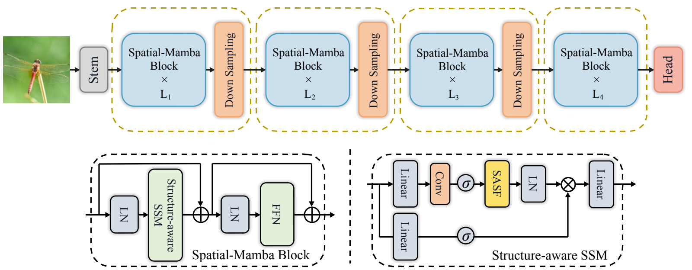
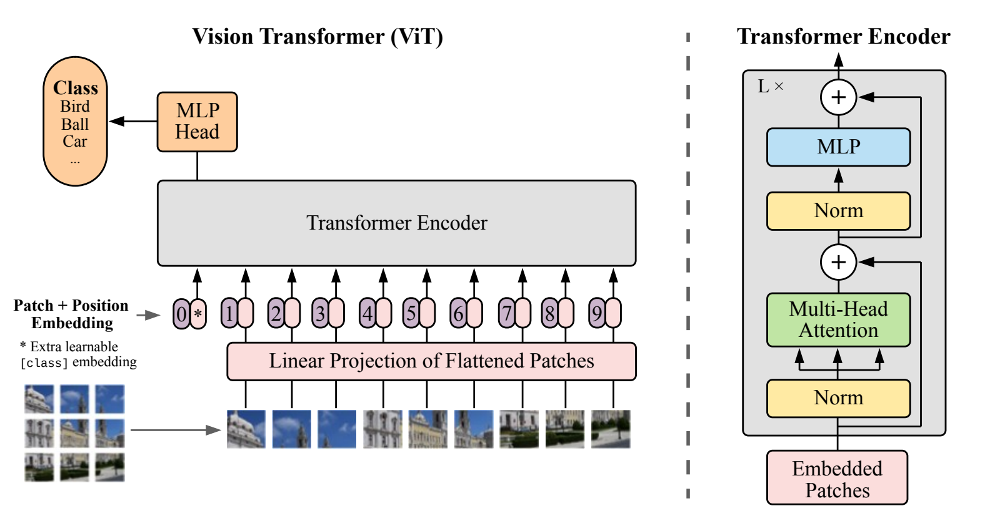

# 真实顶会复杂图测试：v0.2.0

2026-09-06，选取三篇正式收录的 ICLR 论文图，独立完成位图重建、实际 PPTX 渲染和局部
像素测量，再依据首次发现改进运行时。本轮新增 13 项回归，全套 **56 项测试通过**。
三张图的最终版本都通过自动阻断检查，但仍有下表中的保真限制，不能称为完美还原。

| 真实来源 | 复杂度与最终可编辑对象 | 实际渲染观察 |
| --- | --- | --- |
| [ViT，ICLR 2021 Oral](https://iclr.cc/virtual/2021/oral/3458)，作者发布的架构图 | 35 文字、47 形状、50 线、5 自定义箭头、10 照片裁剪 | 代表性文字边缘约 0–1 px；11 个形状描边中心最大差 0.715 px；两条残差箭头头部跨度恢复至源图 |
| [MobileViT，ICLR 2022](https://machinelearning.apple.com/updates/apple-at-iclr-2022)，Figure 1 图面 | 初稿 1207 对象；原生虚线替换后 697 对象，含 91 文字、8 无字图片 | 标题右缘差从 −28 px 修到 0；8 个形状锚点最大 0.5 px；数学式字宽仍有最高 9 px 的局部残差 |
| [Spatial-Mamba，ICLR 2025](https://proceedings.iclr.cc/paper_files/paper/2025/hash/b7216f4a324864e1f592c18de4d83d10-Abstract-Conference.html)，Figure 4 | 39 原生文字，其中 15 个旋转；129 形状、351 线、24 自定义箭头、1 照片 | 15 个旋转标签平均绝对边缘差 0.383 px、最大 1 px；18 个横排文字锚点平均 0.417 px、最大 1 px |

文字边缘与实际基线不是同一个量。上表都是预先隔离区域内的字形/描边测量，使用源像素，
未做图像配准；不是全图相似度，也不覆盖未抽测的每一个对象。原图字体身份不能仅凭位图
唯一确定。本轮没有使用用户的私有图片，没有验证 PowerPoint/WPS 的原生显示。

## 从失败得到的运行时改进

- **旋转文字**：支持按中心旋转 −90°、90°、180°、270°；字体、字重和换行仍是可编辑文字。
  碰撞、容器、越界和实际 PDF 检查同步使用旋转后的位置，文字宽度沿阅读方向检查。
  Spatial-Mamba 的 15 个栅格标签因此全部转成了原生文字。
- **箭头尺寸**：增加 `arrow_head: {length,width}`，生成一个可编辑 freeform，尖端、线身和
  头部共用像素几何。ViT 上残差箭头的实测 `[头部高度,深色核心长度]` 从 `[5,4]` 恢复为
  源图的 `[9,12]`，下残差从 `[4,3]` 恢复为 `[10,11]`。其他箭头仍有 1–2 px 的细节差异。
- **原生虚线**：`dash:[实线长度,间隙长度]` 可用于线条和形状边框。ViT 的分隔线从 17 个
  小线段变成 3 个对象，17 组可见虚线起止位置均在源图 1 px 内。MobileViT 减少 510 个小线段。
- **透明角落碰撞**：MobileViT 中 6 对文字/张量裁剪的框相交，但实际 alpha 与文字墨迹
  相交面积均为 0。现在按图片的真实 alpha 和 contain/cover/stretch 变换检测，移除了这
  6 对专门豁免；碰到不透明图像仍阻断，烘焙文字覆盖检查也继续阻断。
- **等比例图片告警**：图片使用 stretch 但宽高比没变时，不再错误报告已经变形。
- **输入失败边界**：极小描边与超长 dash 的比值在写入 Office 整数属性前拒绝；非法旋转、
  超长箭头头部等不会被悄悄忽略。

修复前的新增回归确实失败：[几何/导出](evidence/conference_cases/diagram_regressions_red.txt)、
[告警与数值边界](evidence/conference_cases/validation_regressions_red.txt)、
[透明角落](evidence/conference_cases/alpha_regressions_red.txt)。
修复后 [56 项测试完整输出](evidence/conference_cases/full_tests_candidate.txt) 均通过。

## 可下载、可复查的文件

| 案例 | PPTX | 场景与 SVG | 实际渲染 | 原始报告 |
| --- | --- | --- | --- | --- |
| ViT | [editable.pptx](../examples/conference_cases/vit/editable.pptx) | [JSON](../examples/conference_cases/vit/scene.resolved.json) · [SVG](../examples/conference_cases/vit/svg/page_001.svg) | [对照图](../examples/conference_cases/vit/render/page_001_comparison.png) | [原始](evidence/conference_cases/vit/original_report.md) · [候选](evidence/conference_cases/vit/candidate_report.md) |
| Spatial-Mamba | [editable.pptx](../examples/conference_cases/spatial_mamba/editable.pptx) | [JSON](../examples/conference_cases/spatial_mamba/scene.resolved.json) · [SVG](../examples/conference_cases/spatial_mamba/svg/page_001.svg) | [对照图](../examples/conference_cases/spatial_mamba/render/page_001_comparison.png) | [独立报告](evidence/conference_cases/spatial_mamba/report.md) |





各案例同目录包含字体清单、验证文件和原图参考 assets；完整文件身份见
[manifest.json](../examples/conference_cases/manifest.json)。
归档的独立报告保留原始临时路径，其原始字节及哈希见 [证据索引](evidence/conference_cases/index.json)。
它们明确区分原始发现和评测期间修改后的 candidate working tree；没有倒改旧结论。

MobileViT 的源图、PPTX、SVG 和场景保留在本地测试输出。下载的 arXiv 版本没有确认通用
再分发授权，因此仓库只收录工程测试报告与固定来源获取脚本，未套用其代码仓库的许可证。
两组可分发图件的作者、原文链接、许可证、修改说明见 [NOTICE](../examples/conference_cases/NOTICE.md)。
所有字体和论文测试素材都不进入 `.skill` 安装包。
MobileViT 的 [完整工程报告](evidence/conference_cases/mobilevit/report.md)、
[最终测量](evidence/conference_cases/mobilevit/candidate_measurements.json) 和
[最初失败](evidence/conference_cases/mobilevit/original_preflight_failure.json) 也已保留；
最终 25 个水平文字 ROI 的绝对边缘差中位数为 1 px、最大 9 px。斜角标签另列，
其中 `3P` 的下边缘差为 −11 px，未混进水平文字统计。

## 复测方法

位图来源先核对正式会议记录。PDF 只用于栅格化和裁剪，独立重建者只接收 PNG、skill 和
空工作目录，不接收 PDF 内部文本坐标、路径或现成答案。流程为看图/OCR 校正 → 场景 →
预检 → 原生 PPTX → LibreOffice PDF → PDFium PNG → 原图同区域测量 → 有限次修复。

在具备对应字体的环境复跑归档案例：

```bash
uv run python scripts/run_real_cases.py --corpus examples/conference_cases --out output/conference_replay
```

本机 ViT 的小字使用 LibreOffice 自带的 Liberation Mono，构建时需要显式提供已有字体目录：

```bash
uv run python scripts/run_real_cases.py --corpus examples/conference_cases \
  --font-dir /Applications/LibreOffice.app/Contents/Resources/fonts/truetype \
  --out output/conference_replay_with_fonts
```

其他机器需要 Times New Roman 和 Liberation Mono，或明确重新选择、检查和披露替代字体。
测试不会自动安装字体。下载/裁剪原始位图供新的独立重建时，可使用：

```bash
uv run python scripts/fetch_conference_sources.py --out output/paper_sources
```

该脚本的三个下载入口均已实际运行并核对 SHA-256。来源变化或哈希不符即失败，旧输出
目录不会被覆盖；`sources.json` 保留已完成及失败步骤。它只取原始素材，不生成答案场景。

## 保留的限制与下一步

- MobileViT 的斜角维度标签目前为水平可编辑文字；6 个无字彩色张量内部仍为图片。
  数学字体间距存在残差；不会通过继续缩小字号或统一豁免来声称解决。
- ViT 的残差圆角和 Spatial-Mamba 的阴影、圆角虚线采用原生对象近似。
  自定义箭头是可编辑 freeform，移动节点后不会自动重新连接。
- 密集下标会暴露实际 PDF 匹配的邻字归属问题：Spatial-Mamba 中过宽的 L 空白框误收了
  相邻下标 3，已保留 [失败报告](evidence/conference_cases/spatial_mamba/neighbor_subscript_failure.json)。
  最终仅收紧空白框宽度，保留可见字形位置；运行时尚未实现完整的逐字归属算法。
- 阴影/图像之间的重叠和虚线间隙仍有保守检测；任意角度旋转、复杂公式、自由曲线路径
  尚未成为可保证的原生能力。`pass` 依然只表示自动检查通过。

原有六例也已复跑，结果仍为 pass、fail、review、review、review、review。旧密集表格的
Quake 字体/网格冲突没有被改成成功；全旧语料运行器继续返回 2。详见 [旧案例记录](real_cases.md)。
