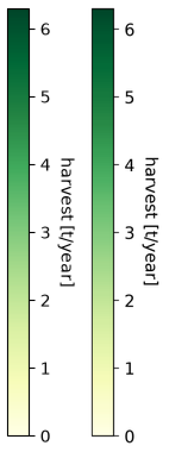

# 四种新结构的真实案例测试

2026-09-07，v0.3.0 增加 CLIP、Swin、Matplotlib 热力图和 DDPM 表格/曲线四种案例。
从实际失败中增加了原生凸多边形、原生线性渐变，并修复主字符与下标的碰撞误报。
本地 **65 项测试通过，无跳过**。四个新场景均通过自动阻断检查，其中两例仍为 `review`；
数学字宽、斜排文字和局部轮廓仍有差异。所有预览来自实际 PPTX，经 LibreOffice 转为 PDF/PNG。

| 案例与结构 | 最终可编辑范围 | 实际检查 | 固定区域测量与剩余差异 |
| --- | --- | --- | --- |
| [CLIP，ICML 2021](https://proceedings.mlr.press/v139/radford21a.html)：流程、相似度矩阵、梯形、密集下标 | 293 个原生对象，含 131 个文字对象；2 个照片区域 | `review`，两条字宽提示 | 21 个文字 ROI 最大边差由 2 降到 1 px；9 处线中心差 0 px。省略点、箭头头部仍近似 |
| [Swin，ICCV 2021](https://openaccess.thecvf.com/content/ICCV2021/html/Liu_Swin_Transformer_Hierarchical_Vision_Transformer_Using_Shifted_Windows_ICCV_2021_paper.html)：四面板、透视照片、窗口网格、残差与公式 | 497 个原生对象，含 92 个文字对象；34 个照片裁片 | `pass` | 30 ROI 的边缘均距中位数 0.573 px，最大单 ROI 均距 3.151 px。混合 ROI、乘号大小、箭头轮廓和裁片浅缝有局限 |
| [Matplotlib 热力图](https://matplotlib.org/3.11.1/gallery/images_contours_and_fields/image_annotated_heatmap.html)：49 个带值色块、色条、旋转标签 | 136 个原生对象，含 64 个文字对象；7 个斜排标签保留为 1 个图片区域 | `review`，斜排标签未原生化 | 固定 ROI 由 70/72 达标变为 72/72；文字边差 ≤2 px、网格 ≤1 px。不是顶会图，也不是全部文字可编辑 |
| [DDPM，NeurIPS 2020](https://proceedings.neurips.cc/paper/2020/hash/4c5bcfec8584af0d967f1ab10179ca4b-Abstract.html)：表格、数学数字、率失真曲线 | 254 个原生对象，含 69 个文字对象；0 图片 | `pass` | 66 ROI 最大边差由 29 降到 14 px，中位绝对边差仍为 1 px；粗体数值、损失下标和不等式间距尚未统一 |

`pass` 只表示自动检查通过。以上像素测量是源图尺寸下的局部诊断，不是还原率；
源字体只能近似判断，字体文件未嵌入。未完成原生 PowerPoint/WPS 外观验证。

## 可以直接打开的文件

| 案例 | 可编辑 PPTX | SVG | 原图与实际渲染对照 | 场景与检查 |
| --- | --- | --- | --- | --- |
| CLIP | [下载](../examples/diverse_cases/clip/editable.pptx) | [SVG](../examples/diverse_cases/clip/svg/page_001.svg) | [对照图](../examples/diverse_cases/clip/render/page_001_comparison.png) | [scene](../examples/diverse_cases/clip/scene.resolved.json) / [validation](../examples/diverse_cases/clip/validation.json) |
| Swin | [下载](../examples/diverse_cases/swin/editable.pptx) | [SVG](../examples/diverse_cases/swin/svg/page_001.svg) | [对照图](../examples/diverse_cases/swin/render/page_001_comparison.png) | [scene](../examples/diverse_cases/swin/scene.resolved.json) / [validation](../examples/diverse_cases/swin/validation.json) |
| 热力图 | [下载](../examples/diverse_cases/heatmap/editable.pptx) | [SVG](../examples/diverse_cases/heatmap/svg/page_001.svg) | [对照图](../examples/diverse_cases/heatmap/render/page_001_comparison.png) | [scene](../examples/diverse_cases/heatmap/scene.resolved.json) / [validation](../examples/diverse_cases/heatmap/validation.json) |

DDPM 的源图来自[作者页面](https://hojonathanho.github.io/diffusion/)，完整图件的再分发许可尚未确认，
PPTX、SVG 和预览保留在本地 `output/diverse_cases_20260906/ddpm/build_final/`。
仓库包含[测量与失败记录](evidence/diverse_cases/ddpm/report.md)。
其他三例的作者、固定下载版本、修改说明和完整许可证见
[NOTICE](../examples/diverse_cases/NOTICE.md)，资产摘要见 [manifest](../examples/diverse_cases/manifest.json)。

## 测试怎样影响了实现

**CLIP 的四个编码器从图片填充改成原生梯形。** 冻结 v0.2.0 中，四个梯形分别用图片填充和
独立边线表示；新版本用 `shape: polygon` 同时保留可编辑顶点、填充和轮廓。
协议只接受 3–32 个按周界排序的严格凸顶点，拒绝自交、凹形、退化点和重复点。
碰撞检查使用实际斜边，梯形空角不会变成障碍物。独立复测的 28 行连续填充边界与源图相同；
它们是发现问题后固定的补充测量，和最初的 30 个 ROI 分开记录。

**CLIP 的九组主字符/下标不再因为字框相交而误报。** 原始 `scene_03` 使用更接近源图的
20 px 下标，却产生九条重叠错误；父任务测得九组字形的实际交集均为 0。
现在将两侧字形遮罩映射到同一坐标后比较，仍保留大小上限和几何回退。
同一原始场景已复查通过；独立候选恢复这些数学对象并完成真实渲染，未添加重叠豁免。
真正重叠的重复文字在水平和 90° 两种测试中仍被阻断。
[原始探测](evidence/diverse_cases/text_pair_probe.json)、[九组复测](evidence/diverse_cases/clip/candidate2/nine_pair_retest.json)。

**热力图用一个原生渐变替代 358 条色带。** 相邻小矩形在实际 PPTX 渲染中出现细黑缝。
新增水平/垂直线性渐变，使用 2–16 个有序色标，在 PPTX 中是 `a:gradFill`，SVG 中是
`linearGradient`。源图采样后，色条内部 RGB 平均绝对误差从 9.341/255 降到 0.665/255，
高分辨率暗残差段从 203 处降到 0。候选第一轮还保留了边框抗锯齿对端点颜色的污染；
改采内部像素后才得到最终结果。矩阵 49 个值保持不变。



色条残差方法在首次发现黑缝后固定，不能当作预先登记的全图验收标准。
最终 64 个原生文字 ROI 的平均掩码 IoU 为 0.5437，说明边界接近仍不等于字形像素一致。
七个约 30° 顶部标签仍是明确标注的图片裁片，没有用重复可编辑文字覆盖。

**Swin 和 DDPM 也保留了自动检查之外的问题。** Swin 的第一次真实导出把相邻独立 `^`
误归属到 z 文本框；该 PDF 文字归属问题尚未修复，本案例改用四条原生短线组成小帽，保留
[原始失败](evidence/diverse_cases/swin/build_02/validation.json)。箭头凹尾、乘号和照片网格浅缝仍可见。
DDPM 通过局部字体、空白框和数学片段位置调整改善字宽，但未宣称运行时已经解决数学排版。
其曲线是按可见蓝色像素描出的 157 个原生窄矩形，不是带原始数据的 Office 图表。

## 独立性、失败与复跑

CLIP、Swin、热力图由三个独立评估任务从指定原图重建，最初只提供冻结的 v0.2.0 skill、
说明及图片。实现代码只计算哈希，不作为答案阅读；没有使用绘图程序、原始数据或 PDF 对象坐标。
父任务依据失败实现修复，再提供单独冻结的候选版本复测；原始报告和候选报告分别保存。
DDPM 由父任务从位图重建，属于开发验证，不计为独立盲测。

| 记录 | 原始报告 | 后续证据 |
| --- | --- | --- |
| CLIP | [冻结基线](evidence/diverse_cases/clip/report_original.md) | [候选一](evidence/diverse_cases/clip/candidate/report_candidate.md)、[候选二](evidence/diverse_cases/clip/candidate2/report_candidate2.md) |
| Swin | [冻结基线与有限修复](evidence/diverse_cases/swin/report_original.md) | [局部视觉复核](evidence/diverse_cases/swin/visual_review_addendum.md) |
| 热力图 | [冻结基线](evidence/diverse_cases/heatmap/report_original.md) | [两轮渐变复测](evidence/diverse_cases/heatmap/report_candidate.md) |
| 运行时 | [基线文件哈希](evidence/diverse_cases/baseline.json) | [候选一](evidence/diverse_cases/candidate.json)、[候选二](evidence/diverse_cases/candidate2.json) |

固定测量区始终保留。Swin 的两个 Layer 标题区混入深红框线，另有模块区混入边框/连线，
报告明确列出，不能作为纯文字对齐证据。CLIP 的宽松填充颜色掩码误纳入孤立像素，初始错误
测量和同一行坐标上的连续段修正也均保留。原始报告没有事后改写成成功。

最终运行时代码重新构建三例分发场景和本地 DDPM，并检查实际渲染与独立最终预览的像素关系；
记录见 [最终复跑](evidence/diverse_cases/final_replay.json)。原有六个通用案例和两例可分发
ICLR 场景也已复跑：状态保持一致，旧 Matplotlib 表格仍在字体/网格处失败，批处理退出码为 2。
本轮另测了该表格的 DejaVu Sans 替换与墨迹顶部对齐，最终仍有一处冲突，
[两个失败报告](evidence/diverse_cases/table_font_probe/) 留存，未改变原始案例。
MobileViT 的本地历史产物未在本轮重建，不把历史成功计成本次新增通过。

累计已测试 13 张真实图片，其中六张来自不同顶会论文；这个数量不代表随机抽样准确率。
完整原始证据的 SHA-256 在 [index.json](evidence/diverse_cases/index.json)，运行、安装包与
发布检查在 [verification_v030.json](evidence/diverse_cases/verification_v030.json)。

## 复现

从仓库运行，输出目录必须尚不存在；使用清单中的字体。macOS 若多个 `fc-list` 共存，
先用 `doctor` 确认实际工具路径，本次使用 `/opt/homebrew/bin/fc-list`。

```bash
uv run python scripts/run_real_cases.py --corpus examples/diverse_cases --out output/diverse_reproduce
uv run python scripts/run_real_cases.py --corpus examples/conference_cases --out output/conference_reproduce
uv run python scripts/run_real_cases.py --out output/legacy_reproduce
```

最后一条预期保留旧密集表格的失败。需要原始下载时可运行：

```bash
uv run python scripts/fetch_conference_sources.py --cases clip swin heatmap ddpm_rate --out output/diverse_sources
```

下载器只接受固定 URL 和已检查的字节哈希。热力图同一 URL 的 PNG 元数据出现两种编码，
初次严格哈希拒绝已保留，确认解码 RGB 完全相同后才明确加入第二个固定哈希；
没有改为接受任意内容。下载器只在仓库中使用，不进入 skill 包。
