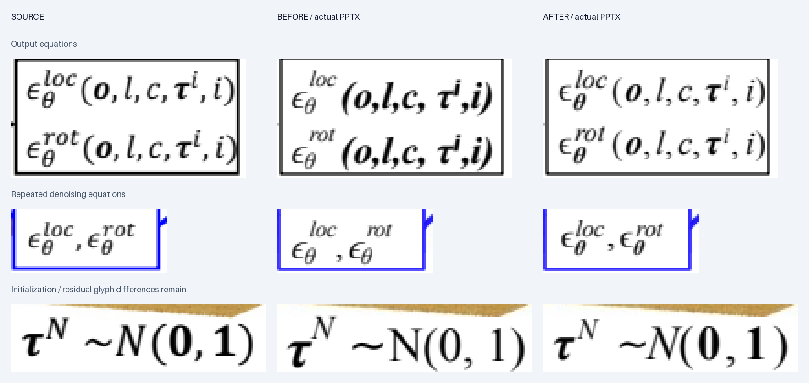

# 更多具身论文图与公式排版修订

2026-09-12，运行时 v0.3.5。新增 OpenVLA Fig.2、ECoT Fig.4、DexVLA Fig.2，
并回修 3D Diffuser Actor Fig.1 的数学排版。[README 实图](../README.md#具身智能与机器人) ·
[十二例文件包](../examples/gallery/paper_gallery.zip) · [校验](../examples/gallery/SHA256SUMS)。

## 实测范围与来源

三个独立任务从官方论文 PDF 栅格图开始，完整保留方法面板。只使用可见像素与本地 OCR，
没有读取源 PDF 的文字/向量坐标或作者绘图代码。来源、页码、裁切和原 PDF 哈希随每例记录。
OpenVLA 与 ECoT 是 CoRL 2024（PMLR 2025 出版）；DexVLA 是 CoRL 2025。
这是参与修正的真实案例实测，不是盲测，也没有合并的转换准确率。

| 完整图 | 原图尺寸 | PDF 页码 / 4 倍栅格裁切 xyxy | 原生对象 | 保留图片 |
| --- | --- | --- | --- | --- |
| OpenVLA Fig.2 | 1276×477 | 4 / [588,284,1864,761] | 23 文字、27 形状、31 线 | 2 照片，8.24% 面积 |
| ECoT Fig.4 | 1587×593 | 5 / [432,285,2019,878] | 40 文字、26 形状 | 11 实例 / 10 资产，含照片、5 图标、1 弯箭头 |
| DexVLA Fig.2 | 1605×500 | 3 / [420,285,2025,785] | 39 文字、216 形状、47 线 | 6 照片/观察图、4 微型机器人运动插画，6.3933% 面积 |

所有新图的 preflight、native_objects、rendered_text 均通过。父任务查看了完整源图、
实际 PPTX 渲染和关键细节，再从发布场景重新构建。四个交付场景（含修订 Diffuser Actor）
的实际渲染均可复现，差异像素数为 **0**；这衡量展示可复现性，**不衡量源图保真**。
见[复建命令与结果](evidence/formula_gallery/replay.json)。

实际 PDF 使用 PDFium 按源图宽度渲染。OpenVLA / ECoT 分别多出一行，经断言整行纯白后
裁去；DexVLA 原始即为 1605×500，没有裁切；Diffuser Actor 为 1589×1052。
没有配准、平移或非等比缩放来掩盖偏移。

- [OpenVLA 报告](../examples/gallery/openvla/REPORT.md)：保留动作 Δ/θ 与括号；局部外框对齐
  仍可能伴随低字形 IoU，De-Tokenizer 等细字不同。Dino 区域受圈号污染的测量已单独标无效。
- [ECoT 报告](../examples/gallery/ecot/REPORT.md)：两处动作向量匹配直立 Δ/Grip 与斜体 x/θ，
  四个检测框和照片内紫色标签为原生对象。该图没有上下标，不能证明复杂脚本排版能力。
- [DexVLA 报告](../examples/gallery/dexvla/REPORT.md)：斜线纹理、FiLM 位置及标题层次经过修正。
  八处开发文字窗口边界差最多 1 px，仅为边缘诊断。斜线遮挡、图标和抗锯齿仍不同；
  “Block x N” 是源图的直立重复标记，没有虚构上下标来增加难度。

## 3D Diffuser Actor：从问题到可复用支持

原稿中整串参数被设为粗斜体，直立标点与常规斜体变量混在一起；Unicode `ⁱ` 触发另一字体，
小公式 θ 与 loc/rot 的脚本位置也不同。修订将两行输出公式、三处去噪公式和初始化分布
替换为 **60 个独立原生文字部件**。当前整图为 **302 个原生对象：102 文本、90 形状、110 线**，
19 块局部图片及图面结构保留。

`compose-math` 是新增的通用命令：作者指定每个符号的字体、粗体/斜体、字号比例和基线偏移，
运行时测量 ascent、descent 与斜体左侧墨迹，输出 scene 文字框。它不猜测图中公式、
不解析 TeX、不产生 OMML 公式对象，也不添加重叠豁免。输出始终为 `unverified`，必须合入
场景再做实际 PPTX 检查。[格式与使用](../skills/super-img2ppt/references/math.md)。

- 用普通 `i` 加字号/基线偏移代替 Unicode `ⁱ`；变量、θ、loc/rot 和标点逐一保留样式。
- 重复小公式使用同一部件布局；按可见像素调整小字基线和 θ 字重，避免只修右上大公式。
- 初始化 N 采用斜体、0/1 采用直立粗体；保留数学关系符 `∼`（U+223C）。
- Times New Roman 缺少 `∼`，该关系符显式单独使用 DejaVu Sans。**不宣称全公式同一字体
  或字形完全一致**；数字宽度、希腊字形、括号和逗号仍与原图有差异。

独立公式测试发现 STIXGeneral 本地测量成功，但 LibreOffice 实际替换了全部九个部件字体，
rendered_text 正确失败。Times New Roman 缺 `∼` 被 helper 拒绝；ASCII `~` 候选虽自动通过，
仍不作为语义等价的最终交付。DejaVu Serif 候选的 τ/上标碰撞被 preflight 阻断。
独立任务在三次修正预算后停止，并明确没有达到源图字形一致。
[原始独立报告](evidence/formula_gallery/diffuser_actor/independent_initialization/REPORT.md)。

父任务整合时保留真正 `∼`，另做显式的符号字体选择；未安装字体、未改变判定阈值。
这不是对 STIX/LibreOffice 替代问题的自动修复。缺字错误现在报告具体部件 ID 和字符，
以便定位；字体能被本地测量，不等于 Office 会采用该字体。

## 失败和修改证据

- `build_01`：新上标与左括号碰撞，停止于 preflight；按源像素增大脚本后的间距。
- `build_02`：遗留旧逗号导致实际文字检查失败；移除被替换的旧部件后 `build_03` 通过。
- `build_04`：初始化部件替换后留下旧 `tauN_sup` 引用，schema 阻断；改为新脚本 ID。
- `build_05`：初始化整合通过；`build_06` 进一步修正重复小公式的字重和基线，通过。
  这些属于不同明确原因的修正，没有用放宽阈值或公式栅格化清除失败。

[逐轮检查](evidence/formula_gallery/diffuser_actor) ·
[逐对象场景差异](evidence/formula_gallery/diffuser_actor/scene_diff.json) ·
[最终公式规格](evidence/formula_gallery/diffuser_actor/math_specs.json)。
除公式文字替换外，共有对象仅 `denoiseN` 的声明引用从旧脚本 ID 改为新 ID；图片、形状和线的
几何未改。旧源图、PPTX、实际 PDF/PNG、完整场景、字体和状态均存档。
其他八例场景与产物保留。九例历史包固定在
[旧提交 56712f5](https://github.com/asimfish/super_img2ppt/blob/56712f5b70ddea937206043e127fe08612c0a9d0/examples/gallery/paper_gallery.zip)。

## 验证与边界

通用回归覆盖原生 PPTX 的逐符号样式、真实 PDF 上下标垂直顺序、无效字体、Unicode 脚本、
非有限坐标、控制字符、超限输入、重复 JSON 字段及新输出目录要求。
[本地完整检查](evidence/formula_gallery/verification.json) ·
[文件与历史资产完整性](evidence/formula_gallery/artifact_checks.json)。

每例包含可编辑 PPTX、SVG、实际渲染、可复建场景、相对路径资产、字体与验证记录，以及
作者归属和许可证。照片与无法分离的插画仍为栅格；字体不嵌入。仅验证 LibreOffice，
原生 Microsoft PowerPoint / WPS 未验证。自动 `pass` 不表示每个字形与源图一致。
